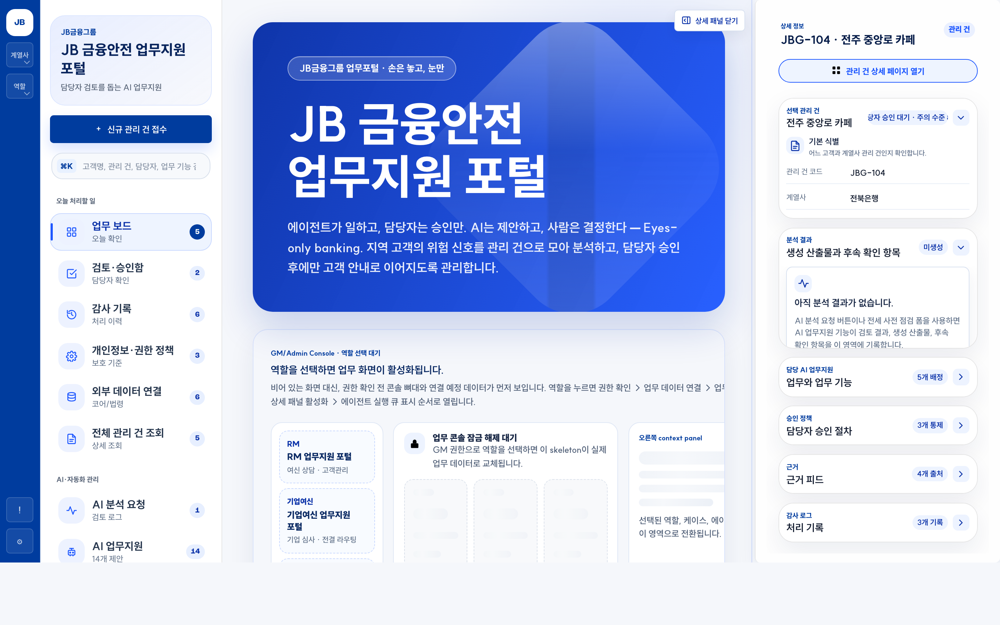
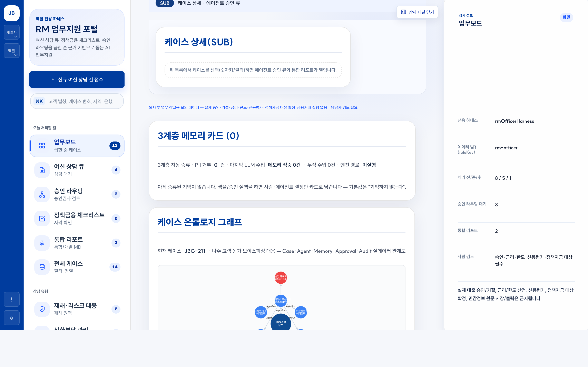
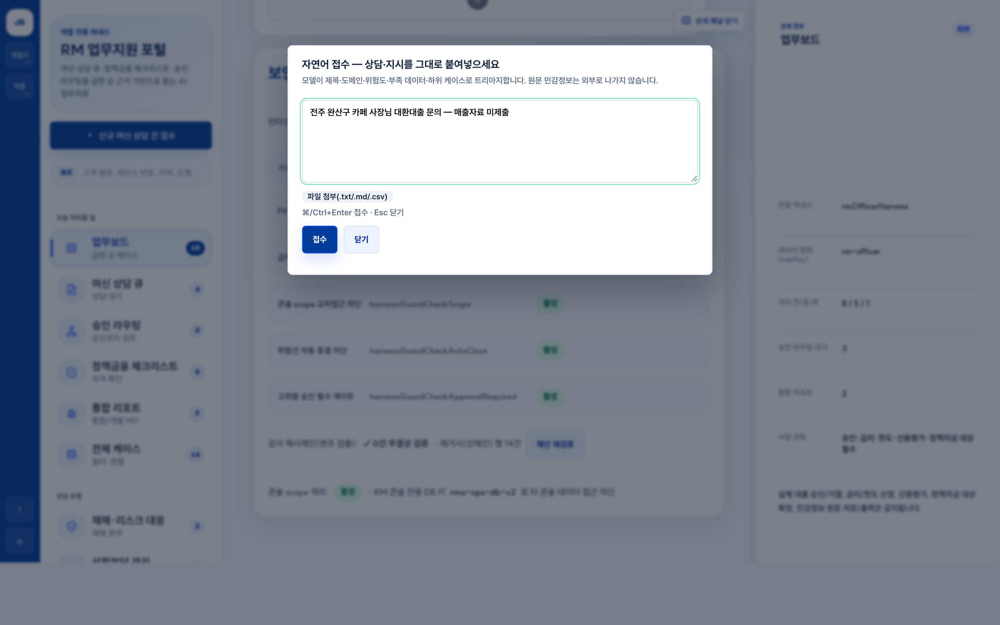
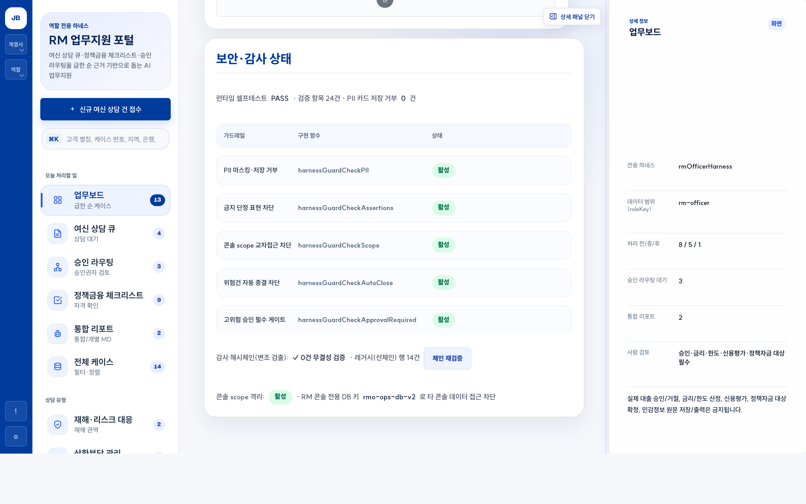
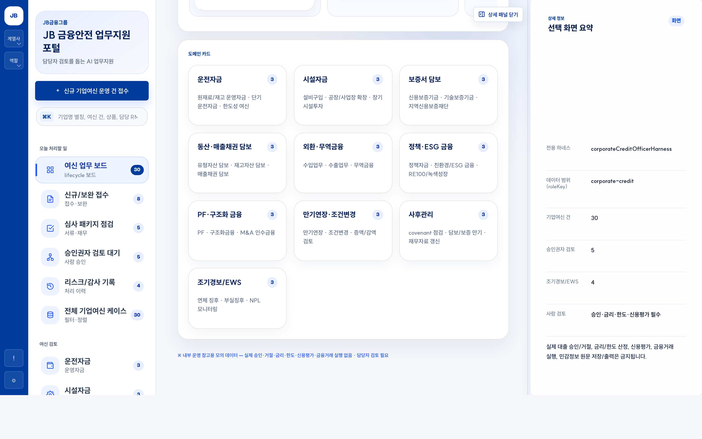
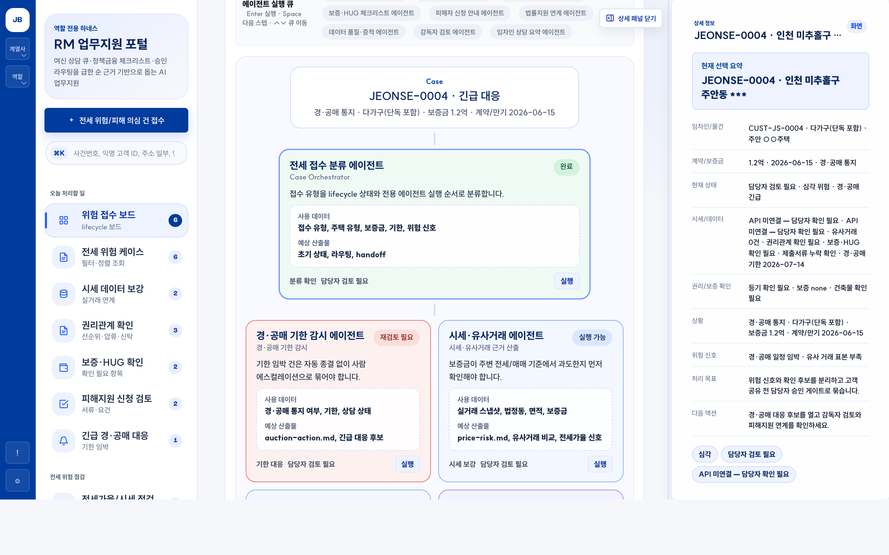
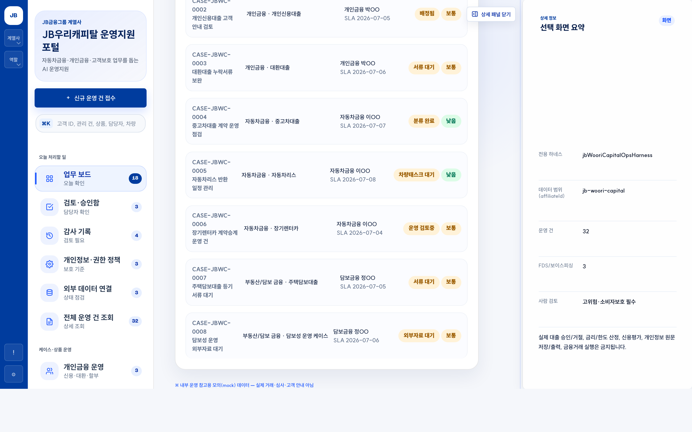

<div align="center">

# 🛡️ JByond

**다음 세대를 잇는 JB금융의 AX Operating System** — 지역 금융 고객의 위험 신호를 모아, AI 에이전트가 판단·행동·검증하되 고객 대상 행동은 사람 승인 전까지 차단하는 금융 AI Agent 운영 콘솔 (구 JB LocalGuard OS, 2026-07-05 리브랜딩)

JB금융그룹 Fin:AI Challenge · 자유주제(JB 미래사업 AI) · **본선(2026-07-04~05)**

[](LICENSE) · `계열사×역할 멀티 콘솔` · `하네스 코어(가드레일·셀프테스트)` · `LLM 게이트웨이(로컬-우선 폴백)` · `데이터 거버넌스(PII 비반출)` · `승인·감사형 자동화`

</div>

---

## 30초 요약

은행 RM·심사·사후관리·준법 담당자는 한 사람이 수십~수백 케이스를 본다. 그런데 위험 신호 — 기사·정책공고·시세·등기·상담기록·사기경보 — 는 **흩어져 있어** 조기에 모아 판단하고 다음 행동으로 잇기 어렵다.

**JByond**는 고객별 위험을 하나의 `Case`로 모으고, 전문 AI 에이전트가 스킬을 장착해 **판단 → 행동 초안 → 검증**을 수행한다. 단, 고객 대상 행동은 **사람 승인 게이트**를 통과해야 하고 모든 판단·행동은 **감사 원장**에 남는다. 챗봇이 아니라 **승인·감사가 가능한 내부 운영체계**라 금융권 실도입 가능성이 높다.

이 저장소가 곧 **본선 제품 코드**다 — **계열사축(전북은행·JB우리캐피탈) × 역할축**으로 나뉜 멀티 콘솔: RM 업무지원 하네스 · 기업여신(CCL) · 전세보호(JPO) · JB우리캐피탈(JBWC). 네 콘솔은 하나의 **하네스 코어**를 공유하며, 코어의 **가드레일**과 **런타임 셀프테스트**(`runHarnessSelfTest`), **E2E 테스트**가 운영 규칙을 실코드로 강제한다.

> **최대 차별점** — 외부 프런티어 LLM의 추론력은 활용하되, **고객 원본 PII·신용정보는 절대 외부로 반출하지 않는다.** (데이터 등급제·PII 정규식 차단·scope 격리·모델 라우팅(로컬 우선)·감사 원장의 다중 방어)

---

## 빠른 시작

**키·모델이 전혀 없어도 오프라인 시뮬레이션으로 전체 데모를 완주한다** — 심사·시연에 API 키나 GPU가 필요하지 않다.

### 전제조건

- `python3` (정적 서버), `Node.js 18+` (Playwright 검증·프록시)
- 선택: `Ollama` (로컬 모델 실동작 시연용)

### 설치 · 실행 (3단)

```bash
git clone https://github.com/River-181/JB_project2.git   # 또는 upstream LSB-afk/JB_project2
cd JB_project2
npm install                     # Playwright 등 (검증용, 시연 자체엔 불필요)

npm run dev                     # → http://127.0.0.1:8000/index.html
```

`npm run dev`만으로 접수 → 분류 → 에이전트 제안 → 사람 승인 → 감사 기록의 전체 운영 루프가 브라우저에서 돈다.

### 선택 단계 (필요할 때만)

```bash
npm run backend        # 로컬 API 서버 :8010 — /api/* (역할·케이스·업로드·감사 로그)
npm run demo:ollama    # 로컬 모델 프록시 :8030 — 사전: ollama pull <모델> (예: exaone3.5)
npm run demo:llm       # LLM 게이트웨이 :8022 — claude→codex→ollama→사람 큐 폴백 사다리
npm run demo:proxy     # 실거래가 프록시 :8020 — ?live=1 용. 키는 .env.example 참고(없으면 자동 폴백)
```

라이브 실데이터 슬라이스는 브라우저에서 `?live=1`을 붙여 확인한다 — 키/프록시가 없으면 시뮬레이션 기본값으로 동일하게 완주한다.

### 검증

```bash
npm run test           # 정적 계약 검증 (파일·핵심 문자열·금지 패턴·JS 문법)
npx playwright test    # Playwright E2E — 11개 spec · 70+ test() (승인·자동종결 불변식 포함)
npm run backend:test   # 로컬 백엔드 API/DB/fallback 검증
```

**5분 시연 동선**은 [`JUDGE_DEMO.md`](JUDGE_DEMO.md) — 전북은행 → 기업여신 콘솔 → 히어로 CCL-0001(전주 카페 운전자금).

### 트러블슈팅

- **포트 충돌** — 8000/8010/8020/8022/8030 사용. 점유 시 각 스크립트의 `PORT` 환경변수(`LLM_GATEWAY_PORT`, `OLLAMA_AGENT_PROXY_PORT` 등)로 변경.
- **Ollama 미기동** — `demo:ollama`는 로컬 Ollama가 떠 있어야 붙는다. 없으면 앱은 자동으로 목업/사람 큐로 폴백하므로 시연은 계속된다.
- **Playwright 미설치** — `npm install` 후 최초 실행 시 `npx playwright install chromium` 한 번 필요할 수 있다.

---

## 실제 작동 화면

| 홈 · 베이스 보드 | RM 하네스 (3계층 메모리 카드 + 케이스 온톨로지) |
| --- | --- |
|  |  |

| 자연어 접수 (n키) | RM 보안·감사 상태 패널 |
| --- | --- |
|  |  |

| 기업여신(CCL) 콘솔 | 전세보호(JPO) 콘솔 | JB우리캐피탈(JBWC) 콘솔 |
| --- | --- | --- |
|  |  |  |

---

## 핵심 차별점 — 데이터 거버넌스 (PII 비반출)

| 단계 | 무엇을 | 어떻게 (본선 실코드) |
| --- | --- | --- |
| ① 데이터 등급제 | 모든 필드에 등급 부여 | `public·internal·confidential·restricted(PII)` 가 모델 라우팅·반출 여부 결정 |
| ② PII 차단·scope 격리 | 외부·교차 반출 사전 차단 | `harnessCore.js` **가드레일**이 PII 정규식(주민·계좌·전화·이메일·여권·외국인등록번호 등 8패턴)을 차단하고, 콘솔별 `localStorage` 키를 넘는 접근을 `harnessGuardCheckScope`로 격리 |
| ③ 모델 라우팅(로컬 우선) | 민감도로 분기 | PII 단계는 **로컬 Ollama(EXAONE)** 에서, 비식별 요약만 프런티어(Claude/Codex)로. LLM 게이트웨이가 `claude→codex→ollama→사람 큐` 폴백 사다리로 배선, 비용은 `llm-runs.jsonl` 원장에 기록 |
| ④ 승인 누락 검사 + 감사 원장 | 자동실행 사전 검사·기록 | 고객 대상 행동은 승인 전 자동실행 금지·high/critical 자동종결 금지(가드레일·**E2E 불변식**), 모든 행위는 append-only 감사 기록 + 해시체인(base·RM 콘솔) |

**법적 근거(검증 완료)** — 신용정보법 §40조의2(특별법 우선, §3조의2), 개인정보보호법 §28조의4·§28조의5 보충, 전자금융감독규정 §15조(망분리), 금융위 망분리 개선 로드맵(2024-08-13).

---

## 본선 신기능 (정직 표기)

- **3계층 메모리 카드** (`rmoMemoryCards.js`) — 고객·에이전트·직원 3계층. PII 게이트 통과 필수, 3회 관측 시 `confirmed` 승격, 실 LLM 입력에 `priorMemory` 주입.
- **라이브 케이스 온톨로지** (`rmoCaseOntology.js`) — cytoscape로 `Case→Agent→Memory→Approval→Audit` 관계를 실데이터로 잇는 그래프.
- **감사 해시체인** — FNV-1a tamper-evident 체인(base 앱 + RM 콘솔). 변조 시 검증 실패를 E2E로 실증(`rmo-audit-chain-tamper.spec.js`).
- **보안·감사 상태 패널** — 가드레일·셀프테스트·PII 거부·체인 검증을 한 화면에서 확인.
- **LLM 게이트웨이 폴백 사다리** (`scripts/llm-gateway.mjs`) — 로컬 `:8030` 직결 → 게이트웨이 `:8022` 폴백 → 오프라인 목업 → 사람 큐.
- **자연어 접수** (`n`키) — 프롬프트+파일첨부 → 로컬모델 triage → 케이스·서브케이스 생성·부족 데이터 요청(오프라인 폴백 완주).
- **PII 가드 8패턴** — 오탐 0 실측 확장(이메일·여권·외국인등록번호 포함).

> **목업 vs 실동작 구분** — 콘솔 라우팅·`computeRiskDecision`·가드레일·셀프테스트·`?live=1` 공공데이터 fetch·scope 격리·해시체인은 **실동작**한다. 반면 **에이전트 산출 텍스트는 대부분 템플릿(목업)** 이며, 실 LLM 호출은 RM·기업여신 샘플 경로와 게이트웨이 배선에 한정된다.

---

## 에이전트 팀 구성

| 라인 | 에이전트 |
| --- | --- |
| 운영 지휘·분석 | 운영 조율 · 포트폴리오 분석 |
| 위험·금융 판단 | 위험신호 조기감지 · 상환위험 분류 · 정책금융 매칭 |
| 전세 보호 | 전세위험 관리 리드 · 전세가율 분석 · 등기 권리 분석 · 임차인 손실위험 |
| 준법·차단·계약 | 이상거래 탐지·차단 · 준법 검토 · 계약 체크리스트 |
| 고객·은행 연계 | RM 보좌 · 은행 연계 |

조직도에는 14종 에이전트를 배치하되, 본선 데모에서는 **4~5종을 실동작**시킨다(범위 정직 표기). 사람 승인자(RM·준법) + 승인 게이트가 모든 고객 대상 행동을 통제하고, RM·전세보호 콘솔은 **키보드 퍼스트 승인 UX**(Enter/Space)를 우선 적용한다.

---

## 저장소 구성

```
JB_project2/
├── README.md · JUDGE_DEMO.md · AGENTS.md · DESIGN.md
├── LICENSE(MIT) · THIRD-PARTY-NOTICES.md · .env.example
├── app/                     멀티 콘솔 정적 SPA (프레임워크·빌드 없음)
│   ├── index.html · app.js                        # 셸 + 라우팅 디스패처(applyHashRoute)
│   ├── harnessCore.js · harnessVerification.js     # 가드레일 · 런타임 셀프테스트(실코드)
│   ├── rmoMemoryCards.js · rmoCaseOntology.js       # 3계층 메모리 카드 · 라이브 온톨로지
│   ├── rmOfficer.* · corporateCredit.*              # RM 하네스 · 기업여신 콘솔
│   ├── jeonseProtection.* · wooricap.*/jbWooriCapital*  # 전세보호 · JB우리캐피탈 콘솔
│   └── HARNESS_GUIDE.md · ROLE_HARNESS_CONTRACT.md · SECURITY_GUARDRAILS.md
├── server/                  로컬 백엔드 API 서버 + JSON 파일 저장소
├── scripts/                 verify_static.py(정적 게이트) · api-proxy · llm-gateway · ollama-agent-proxy
├── tests/e2e/               Playwright E2E (11 spec) · tests/backend/ (Node test)
└── docs/                    아키텍처·DB 연동·콘솔 설계 · images/(스크린샷) · competition-planning/(기획·증빙 이관본)
```

> `node_modules/`·`test-results/`·`server/data/`는 생성물·상태라 `.gitignore` 처리되어 저장소에 포함되지 않는다.

---

## 문서

| 문서 | 내용 |
| --- | --- |
| [JUDGE_DEMO.md](JUDGE_DEMO.md) | 심사위원 5분 시연 가이드(전북은행 → 기업여신 → CCL-0001) |
| [docs/01-시스템-아키텍처.md](docs/01-시스템-아키텍처.md) | 전체 구성도, 운영 계약(Case→…→Audit), 에이전트 하네스, 가드레일 |
| [docs/02-은행-DB-연동-설계.md](docs/02-은행-DB-연동-설계.md) | 기존 은행 DB(계정계/정보계/FDS/전자결재) 연결 방안 — 로드맵·데이터 매핑·보안 통제 |
| [docs/03-JB우리캐피탈-하네스.md](docs/03-JB우리캐피탈-하네스.md) · [docs/04-전세보호-역할-하네스.md](docs/04-전세보호-역할-하네스.md) · [docs/05-RM-하네스.md](docs/05-RM-하네스.md) | 콘솔·역할별 하네스 설계 |
| [docs/06-백엔드-서버.md](docs/06-백엔드-서버.md) · [docs/07-백엔드-루프-검증.md](docs/07-백엔드-루프-검증.md) | 로컬 백엔드 API 계약·구축 루프 |
| [docs/08-심사기준-개선-플랜.md](docs/08-심사기준-개선-플랜.md) | 심사 5축 대응 플랜(모의심사·축별 액션·담당 레인) |
| `docs/competition-planning/` | 기획·전략·증빙 워크스페이스 이관본(PR#5 병합 시 등장, `MIGRATION.md` 안내 동봉) |

---

## 발전 경로 · 현재 한계

**발전 경로** — PoC(현재) → 파일럿(1개 영업본부 RM) → 내부 적용(사후관리·심사 보조) → 고객 서비스화. 계열사·업무영역·고객군으로 스킬 추가 확장.

**현재 한계** — 에이전트 출력 텍스트 목업(LLM 게이트웨이 실호출 통합 진행 중) · 해시체인 감사는 base·RM 콘솔 우선 · 키보드 퍼스트 UX는 RM·전세보호 콘솔 우선 · 실데이터 어댑터(등기·HUG·은행 시스템) 다수 미연결 · 모델 품질 검증(오탐/미탐 테스트셋) 필요.

---

## 한 줄 정리

> **JByond** — 외부 LLM은 쓰되 고객 PII는 내보내지 않는, 계열사×역할 멀티 콘솔로 승인·감사하는 지역 금융 AI Agent 운영체계.

## 라이선스

MIT © 2026 망상궤도(Team Mangsang-Gwedo). 제3자 구성요소(Cytoscape.js·Pretendard 등)는 [THIRD-PARTY-NOTICES.md](THIRD-PARTY-NOTICES.md) 참조.
