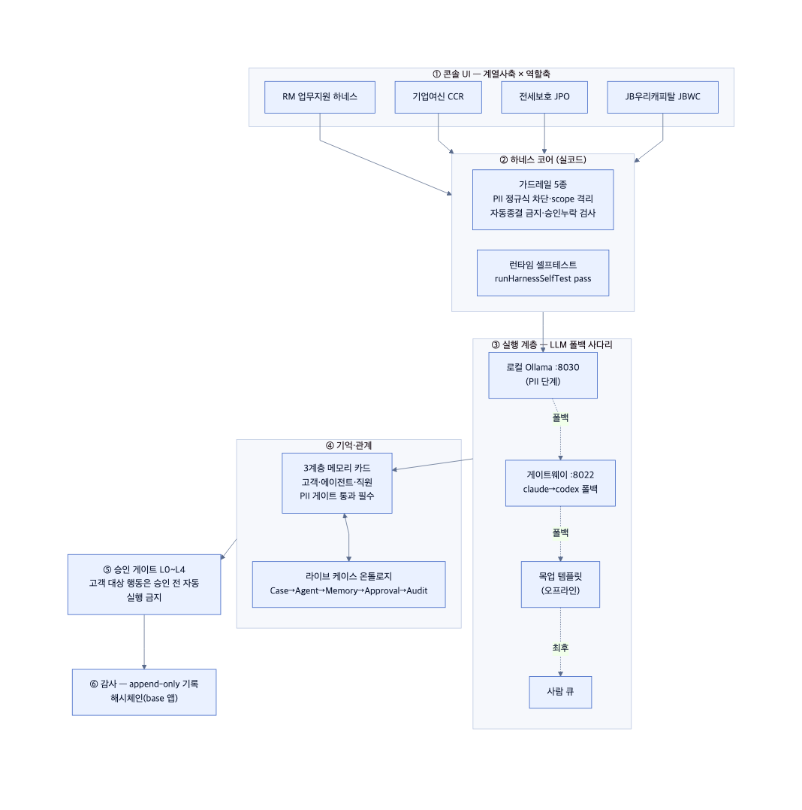
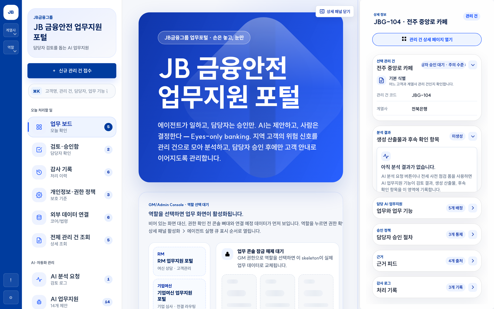
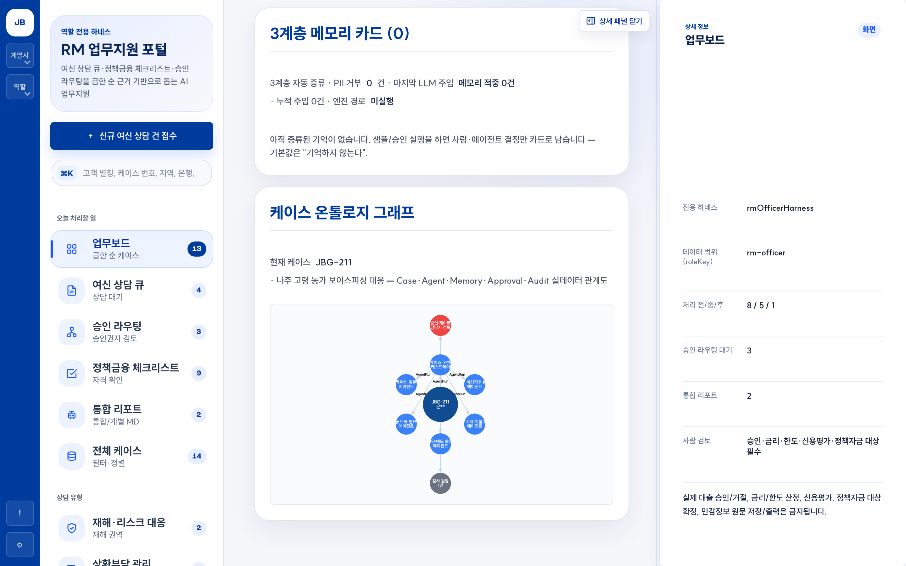
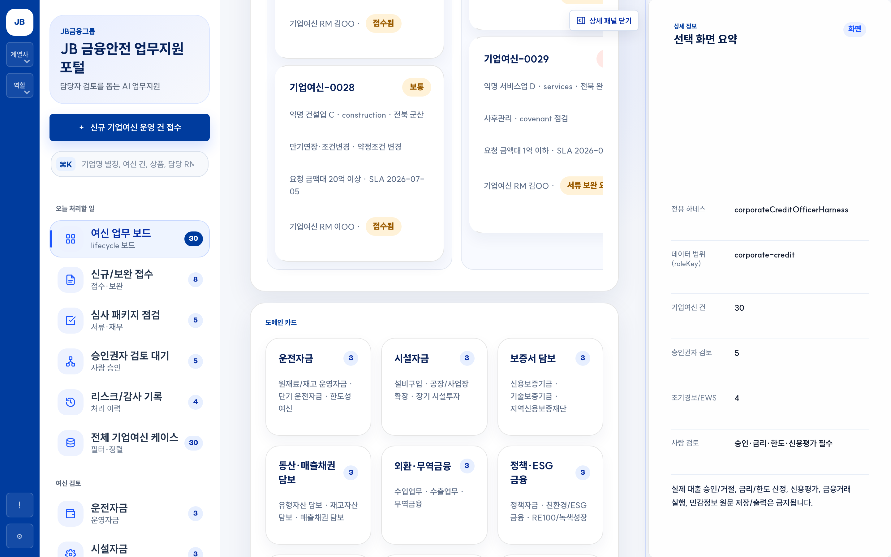
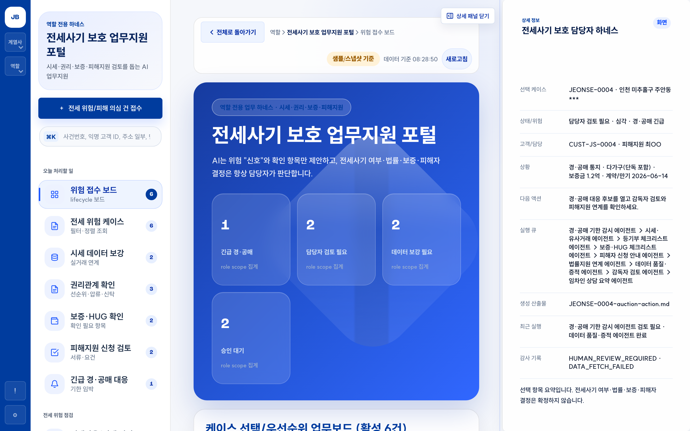
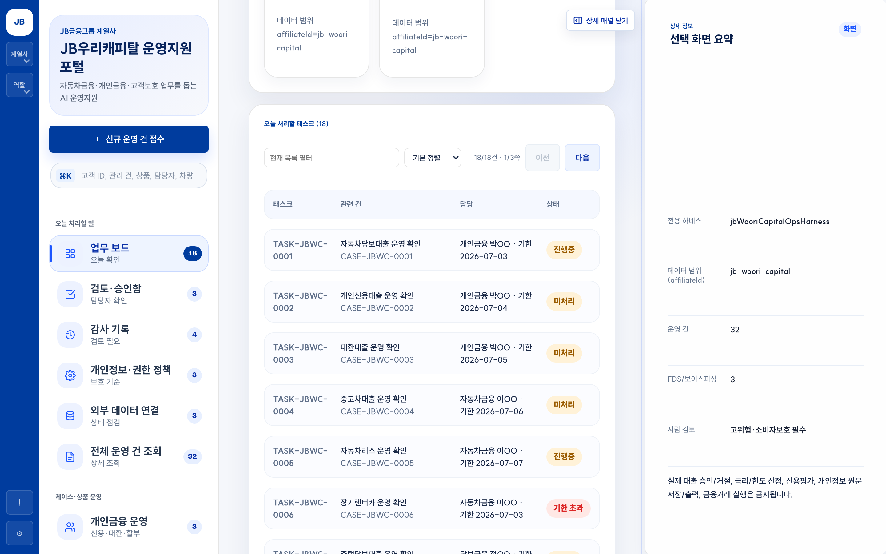

<div align="center">

# 🛡️ JB LocalGuard OS

**지역 금융 고객의 위험 신호를 모아, AI 에이전트가 판단·행동·검증하되 — 고객 대상 행동은 사람 승인 전까지 차단하는 금융 AI Agent 운영 콘솔**

JB금융그룹 Fin:AI Challenge · 자유주제 (JB 미래사업 AI) · **본선(2026-07-04~05)**

`계열사×역할 멀티 콘솔` · `하네스 코어(가드레일·셀프테스트)` · `LLM 게이트웨이(로컬-우선 폴백)` · `데이터 거버넌스(PII 비반출)` · `승인·감사형 자동화`

</div>

---

## 30초 요약

은행 RM·심사·사후관리·준법 담당자는 한 사람이 수십~수백 케이스를 본다. 그런데 위험 신호 — 기사·정책공고·시세·등기·상담기록·사기경보 — 는 **흩어져 있어** 조기에 모아 판단하고 다음 행동으로 잇기 어렵다.

**JB LocalGuard OS**는 고객별 위험을 하나의 `Case`로 모으고, 전문 AI 에이전트가 스킬을 장착해 **판단 → 행동 초안 → 검증**을 수행한다. 단, 고객 대상 행동은 **사람 승인 게이트**를 통과해야 하고 모든 판단·행동은 **감사 원장**에 남는다. 챗봇이 아니라 **승인·감사가 가능한 내부 운영체계**라 금융권 실도입 가능성이 높다.

본선 제품은 **계열사축(전북은행·JB우리캐피탈) × 역할축**으로 나뉜 멀티 콘솔이다 — RM 업무지원 하네스 · 기업여신(CCR) · 전세보호(JPO) · JB우리캐피탈(JBWC). 네 콘솔은 하나의 **하네스 코어**를 공유하며, 코어의 **가드레일 5종**과 **런타임 셀프테스트**(`runHarnessSelfTest`), **E2E 73 테스트**가 운영 규칙을 실코드로 강제한다.

> **최대 차별점** — 외부 프런티어 LLM의 추론력은 활용하되, **고객 원본 PII·신용정보는 절대 외부로 반출하지 않는다.** (데이터 등급제·PII 정규식 차단·scope 격리·모델 라우팅(로컬 우선)·감사 원장의 다중 방어)

---

## 작동 구조 — Case에서 Audit까지



`Case → AgentRun → Agent → Skill → Memory → Approval → Audit` — 정적 분석 보고서가 아니라 **상태가 실제로 변하는 운영 루프**다. 계열사×역할 콘솔 4종이 **하네스 코어**(가드레일·셀프테스트)를 통과해 **실행 계층의 폴백 사다리**(로컬 Ollama `:8030` 직결 → 게이트웨이 `:8022` 폴백 → 오프라인 목업 → 사람 큐)로 내려가고, **3계층 메모리 카드**와 **라이브 케이스 온톨로지**(cytoscape)가 케이스 관계를 실데이터로 잇는다. 마지막은 **승인 게이트**와 **append-only 감사**다.

> 편집용 원본: [`본선-시스템-아키텍처-20260705.excalidraw`](08_본선/03_제품/05_diagrams/본선-시스템-아키텍처-20260705.excalidraw)

---

## 핵심 차별점 — 데이터 거버넌스 (PII 비반출)


| 단계 | 무엇을 | 어떻게 (본선 실코드) |
| --- | --- | --- |
| ① 데이터 등급제 | 모든 필드에 등급 부여 | `public·internal·confidential·restricted(PII)` 가 모델 라우팅·반출 여부 결정 |
| ② PII 차단·scope 격리 | 외부·교차 반출 사전 차단 | `harnessCore.js` **가드레일**이 PII 정규식(주민·계좌·전화)을 차단하고, 콘솔별 `localStorage` 키를 넘는 접근을 `harnessGuardCheckScope`로 격리 |
| ③ 모델 라우팅(로컬 우선) | 민감도로 분기 | PII 단계는 **로컬 Ollama(EXAONE)** 에서, 비식별 요약만 프런티어(Claude/Codex)로. LLM 게이트웨이가 `claude→codex→ollama→사람 큐` 폴백 사다리로 배선(PR#4), 비용은 `llm-runs.jsonl` 원장에 기록 |
| ④ 승인 누락 검사 + 감사 원장 | 자동실행 사전 검사·기록 | 고객 대상 행동은 승인 전 자동실행 금지·high/critical 자동종결 금지(가드레일·**E2E 불변식**), 모든 행위는 append-only 감사 기록 + 해시체인(base 앱) |

**법적 근거(검증 완료)** — 은행은 **신용정보법 §40조의2**(특별법 우선, §3조의2), 개인정보보호법 **§28조의4·§28조의5** 보충, **전자금융감독규정 §15조(망분리)**. 금융위 **망분리 개선 로드맵(2024-08-13, 다층보안체계·생성형 AI 클라우드 허용)**. → [근거 검증 문서](06_증빙/legal-citation-verification.md) · [편집 가능 Excalidraw](02_제품/자산/diagrams/governance-4defense.excalidraw.url)

---

## 에이전트 팀 구성


| 라인 | 에이전트 |
| --- | --- |
| 운영 지휘·분석 | 운영 조율 · 포트폴리오 분석 |
| 위험·금융 판단 | 위험신호 조기감지 · 상환위험 분류 · 정책금융 매칭 |
| 전세 보호 | 전세위험 관리 리드 · 전세가율 분석 · 등기 권리 분석 · 임차인 손실위험 |
| 준법·차단·계약 | 이상거래 탐지·차단 · 준법 검토 · 계약 체크리스트 |
| 고객·은행 연계 | RM 보좌 · 은행 연계 |

조직도에는 14종 에이전트를 배치하되, 본선 데모에서는 **4~5종을 실동작**시킨다(범위 정직 표기). 사람 승인자(RM·준법) + 승인 게이트가 모든 고객 대상 행동을 통제하고, **RM·전세보호 콘솔은 키보드 퍼스트 승인 UX**(Enter/Space)를 우선 적용한다.

---

## 실제 작동 화면

| 홈 · 베이스 보드 | RM 하네스 (3계층 메모리 카드 + 케이스 온톨로지) |
| --- | --- |
|  |  |

| 기업여신(CCR) 콘솔 | 전세보호(JPO) 콘솔 |
| --- | --- |
|  |  |

> JB우리캐피탈(JBWC) 콘솔 — 계열사축 전환: 

---

## 우리가 풀려는 문제 (검증된 데이터)

| 도메인 | 근거 | 담당 에이전트 |
| --- | --- | --- |
| 소상공인 자금압박 | 자영업자 대출 1,064조 · 취약 차주 42.7만명(연체율 11.16%) · 2024 폐업 100.8만명 | 상환위험 분류 |
| 전세사기 | 피해 인정 약 3.9만건 · HUG 사고액 2024년 4.49조원 | 전세위험 관리 리드 |
| 보이스피싱 | 2025년 1~11월 피해액 1.13조원(+56%) | 이상거래 탐지·차단 |

세 도메인은 JB 계열사 업무에 그대로 매핑된다 — **소상공인 자금압박·전세사기 → 전북은행**(지역 기반 기업여신·전세보호), **보이스피싱/FDS → 전북은행 + JB우리캐피탈**(개인·자동차금융 소비자보호). 출처·신뢰도는 [심사 인용 카드](06_증빙/01-심사인용카드.md)에서 1:1 추적.

---

## 빠른 시작

본선 제품 코드는 별도 저장소 **`LSB-afk/JB_project2`**(최신 `main` 8c274b5 + PR#4, 약 24,600줄)다.

```bash
git clone https://github.com/LSB-afk/JB_project2.git
cd JB_project2
npm install                     # Playwright 등 (검증용)

npm run dev                     # = python3 -m http.server 8000 --directory app
# http://127.0.0.1:8000/index.html
```

데모 경로: **전북은행 → 기업여신 콘솔 → 히어로 CCL-0001(전주 카페 운전자금)**. 실데이터 슬라이스는 국토부 실거래가 API(`?live=1`, 실패 시 자동 폴백), 로컬 모델은 Ollama 실행 경로로 붙는다. 5분 시연은 [`JUDGE_DEMO.md`](https://github.com/LSB-afk/JB_project2/blob/main/JUDGE_DEMO.md).

검증:

```bash
npm run test        # 정적 검증 (verify_static.py 문자열 계약)
npm run test:e2e    # Playwright E2E (73 테스트 · 승인·자동종결 불변식 포함)
```

> 이 저장소(`JB-Fin-AI-Challenge`)는 문서·전략·증빙의 **모노레포**이고, 제품 코드는 위 `JB_project2`에서 실행한다.

---

## 저장소 구성

최상위는 **예선 번호 폴더(00–07) + `_체계`** 와 **본선 워크스페이스 `08_본선/`**, 그리고 별도 제품 코드 `JB_project2`로 구성된다.

```
JB-Fin-AI-Challenge/
├── README.md · _MOC.md · _canon.md   # 관문 · 탐색 지도 · 사실 단일 출처(SSOT)
├── 00_제출/        🟦 제출물 — 제안서·기능명세서·발표 데크 · 예선 README 보관본
├── 01_전략/        문제정의·JB 사업연계·경쟁차별성·자유주제 포지셔닝
├── 02_제품/        예선 MVP 소스 · 검증 스크립트 · 자산(스크린샷·다이어그램)
├── 03_에이전트/    에이전트 프롬프트 계약·모델 라우팅/거버넌스·안전정책
├── 04_아키텍처/    시스템·데이터·API·거버넌스 다이어그램
├── 05_리서치/      Pain-point·JB 사업·데이터/API/라이선스 (출처 검증)
├── 06_증빙/        심사 인용카드·법령정책 근거·증빙추적·출처 인덱스
├── 07_원천/        대회 PDF·정독 노트
├── 08_본선/        🟦 본선 워크스페이스 — harness.yaml · 03_제품(설계·스펙) · 05_diagrams · 심사기준 개선 플랜
└── _체계/          운영 규칙 · 심사기준

LSB-afk/JB_project2 (제품 코드, 별도 저장소)
├── app/            멀티 콘솔 — RM 하네스 · 기업여신(CCR) · 전세보호(JPO) · JB우리캐피탈(JBWC)
│   ├── harnessCore.js · harnessVerification.js   # 가드레일 5종 · 런타임 셀프테스트(실코드)
│   ├── rmoMemoryCards.js · rmoCaseOntology.js    # 3계층 메모리 카드 · 라이브 온톨로지
│   └── *Console.*.js                              # 콘솔별 뷰·규칙·에이전트 레지스트리
├── JUDGE_DEMO.md · THIRD-PARTY-NOTICES · LICENSE(MIT)
└── tests/          Playwright E2E (73 테스트)
```
> `node_modules/`·`test-results/`는 npm/Playwright 생성물이라 `.gitignore` 처리되어 저장소에 포함되지 않는다.

---

## 심사자 5분 경로

1. [`JUDGE_DEMO.md`](https://github.com/LSB-afk/JB_project2/blob/main/JUDGE_DEMO.md) — 5분 시연 가이드(전북은행 → 기업여신 → CCL-0001)
2. [`08_본선/03_제품/harness.yaml`](08_본선/03_제품/harness.yaml) — 문서↔규칙↔평가↔에이전트↔승인 게이트를 잇는 단일 매니페스트
3. [`08_본선/03_제품/reports/구현현황-JB_project2.md`](08_본선/03_제품/reports/구현현황-JB_project2.md) — **코드-리얼리티 SSOT**: REAL vs MOCKED 인벤토리(grep 검증)
4. `JB_project2` 실행 → `?live=1` 로 실거래가 슬라이스, RM 콘솔에서 메모리 카드·온톨로지 확인
5. [`JB_project2/docs/08-심사기준-개선-플랜.md`](https://github.com/LSB-afk/JB_project2/blob/main/docs/08-심사기준-개선-플랜.md) — 심사 5축 대응 플랜

전체 지도: [`_MOC.md`](_MOC.md) · 발표/제출: [`00_제출/`](00_제출/)

---

## 기술 구성

- **본선 제품(JB_project2)**: 계열사×역할 멀티 콘솔(RM·CCR·JPO·JBWC)을 하나의 **하네스 코어**가 공유. `harnessCore.js`의 가드레일 5종(PII 차단·scope 격리·자동종결 금지·승인 누락 검사)과 `harnessVerification.js`의 런타임 셀프테스트는 **실코드로 동작**(목업 아님). 콘솔별 `localStorage` 키로 상태 격리, 라우팅 디스패처가 콘솔별 `*RouteFromHash()`로 분기.
- **실데이터·실모델**: 국토부 실거래가 API(`?live=1`, 폴백 자동) · 로컬 Ollama 실행 경로 · LLM 게이트웨이 3엔진 폴백 사다리(`claude→codex→ollama→사람 큐`, 비용원장 `llm-runs.jsonl`, PR#4 배선).
- **기억·관계**: 3계층 메모리 카드(고객·에이전트·직원 — PII 게이트 통과 필수, 3회 관측 시 `confirmed` 승격, 실 LLM 입력에 `priorMemory` 주입) + 라이브 케이스 온톨로지(cytoscape, `Case→Agent→Memory→Approval→Audit`).
- **정직성**: 에이전트 **출력 텍스트는 아직 목업 템플릿**(커밋된 LLM API 호출은 게이트웨이 배선 한정)이고, 해시체인 감사는 base 앱에만 있다. 파이프라인·가드레일·셀프테스트·`?live=1` fetch·scope 격리는 실동작.

## 발전 경로

PoC(현재) → 파일럿(1개 영업본부 RM) → 내부 적용(사후관리·심사 보조 — 네이버클라우드 MOU 방향과 정합) → 고객 서비스화. 계열사(광주은행·JB우리캐피탈)·업무영역(기업여신 심사·WM)·고객군으로 스킬 추가 확장.

## 운영 리스크 대응

개인정보·보안(PII 비반출 가드레일·scope 격리) · 환각(에이전트는 근거·불확실성·다음 확인 항목 의무 출력) · 설명가능성(점수 분해·출처 칩·승인 라우팅) · 책임소재(승인 게이트 + append-only 감사 원장) · 저작권(외부 데이터 라이선스·출처 명시 — `THIRD-PARTY-NOTICES`).

## 현재 한계

에이전트 출력 텍스트 목업(LLM 게이트웨이 실호출 통합은 진행 중) · 해시체인 감사 base 앱 한정 · 키보드 퍼스트 UX는 RM·전세보호 콘솔 우선 · 실데이터 어댑터(등기·HUG·은행 시스템) 다수 미연결 · 모델 품질 검증(오탐/미탐 테스트셋) 필요.

---

## 한 줄 정리

> **JB LocalGuard OS** — 외부 LLM은 쓰되 고객 PII는 내보내지 않는, 계열사×역할 멀티 콘솔로 승인·감사하는 지역 금융 AI Agent 운영체계.

<div align="center">

[심사자 시연(JUDGE_DEMO)](https://github.com/LSB-afk/JB_project2/blob/main/JUDGE_DEMO.md) · [harness.yaml](08_본선/03_제품/harness.yaml) · [구현현황 SSOT](08_본선/03_제품/reports/구현현황-JB_project2.md) · [Canon](_canon.md) · [MOC](_MOC.md)

</div>
