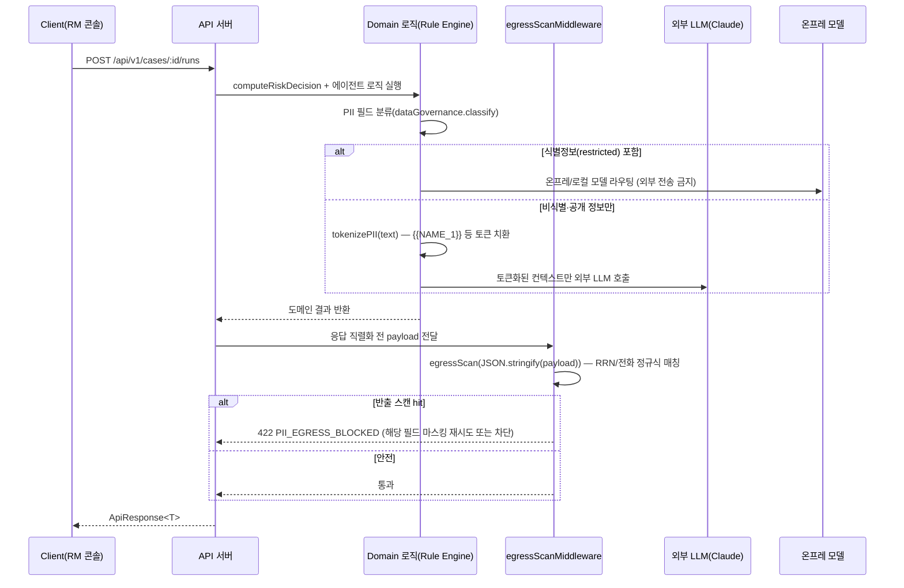

---
tags:
  - area/product
  - type/spec
  - status/draft
date: 2026-07-03
up: "[[INDEX|제품 인덱스]]"
---

# API 명세

> 신뢰마커: **[확정]** = `02_제품/app/app.js`·`modules.js` 소스 또는 `_canon.md`에서 직접 확인. **[조건부]** = 본선 설계 제안(코드 미검증, 착수는 사용자 승인 후). **(TBD)** = 미정.

이 문서는 MVP 정적 함수 계약(`computeRiskDecision`·`buildDashboardData`·`auditChainRecords`·`moveCaseToColumn`)을 서버 REST API로 1:1 승격하는 설계다. 엔티티 스키마는 [[08_본선/03_제품/04_tech/data-model|데이터 모델]] 참조.

- SSOT: [[JB-콘솔-프로토타입-스펙-가안|콘솔 프로토타입 스펙]], `_canon.md` §8(운영 계약)
- 스택 방향(확정 미구현): `_체계/본선-백엔드-실연동-설계.md` — Node.js+TypeScript 단일 코드베이스, 로컬 SQLite, `AGENT_MODE=rule|llm` env 토글, **"멀티유저 인증"은 본선 D-8 범위 밖으로 명시 확정** — 이 문서 §7 인증 설계는 그 결정을 뒤집지 않고 **차기 구현을 위한 설계만** 남긴다 [조건부].

---

## 0. API 설계 원칙

1. **REST, JSON 전용.** 경로 프리픽스 `/api/v1`. 리소스는 [[08_본선/03_제품/04_tech/data-model|데이터 모델]] 7엔티티 그대로(Cases/AgentRuns/Agents/Skills/Evidence/Approvals/Audit) + 집계 리소스(Dashboard).
2. **승인 게이트가 미들웨어로 강제된다.** 고객 대상 행동을 유발하는 모든 엔드포인트는 `requireApprovalGate()`를 통과해야 한다 — 통과 전 자동 실행 금지는 코드 조건이 아니라 **미들웨어 계약**이다(§4.3, §8).
3. **PII 반출 스캔은 응답 직렬화 지점의 필수 관문이다.** 모든 응답 바디는 클라이언트로 나가기 직전 `egressScanMiddleware()`를 통과한다(§9). 외부 LLM 호출도 동일 관문을 통과한다.
4. **감사는 옵션이 아니다.** Case/Approval/AgentRun 상태를 변경하는 모든 엔드포인트는 같은 트랜잭션 안에서 `AuditEvent`를 1건 이상 적재한다 — 실패 시 상태 변경도 롤백.
5. **4 함수계약 → 엔드포인트는 1:1이 원칙.** 이름·입출력 구조가 최대한 그대로 이어지도록 설계(§1 매핑표). 재작성은 최소화한다(`_체계/본선-백엔드-실연동-설계.md` §2 "계약 우선 씬 백엔드" 결정과 일치).

---

## 1. 4 함수계약 → 서버 엔드포인트 매핑

| MVP 함수 | 위치 | 서버 엔드포인트 | 메서드 |
|---|---|---|---|
| `computeRiskDecision(item)` | `app.js:4936` | `POST /api/v1/cases/:id/risk-decision` (재계산) 또는 `GET /api/v1/cases/:id`의 `riskSignals` 필드(캐시) | POST / GET |
| `buildDashboardData()` | `app.js:4857` | `GET /api/v1/dashboard` | GET |
| `auditChainRecords(item)` | `app.js:4743` | `GET /api/v1/audit/cases/:id` | GET |
| `moveCaseToColumn(caseId, column)` | `app.js:5597` | `PATCH /api/v1/cases/:id/column` | PATCH |

---

## 2. 공통 포맷

### 2.1 ApiResponse\<T\>

프로젝트 표준 TS 응답 포맷을 그대로 채택 [조건부, 본선 스택=Node.js+TypeScript 결정과 정합]:

```typescript
interface ApiResponse<T> {
  success: boolean
  data?: T
  error?: ApiError
  meta?: {
    total: number
    page: number
    limit: number
  }
}

interface ApiError {
  code: string              // 예: "APPROVAL_LEVEL_MISMATCH", "PII_EGRESS_BLOCKED"
  message: string           // 사람이 읽는 메시지(한글)
  details?: Record<string, unknown>
}
```

### 2.2 에러 포맷 예시

```json
{
  "success": false,
  "error": {
    "code": "PII_EGRESS_BLOCKED",
    "message": "응답에 식별정보 원문(전화번호)이 포함되어 반출을 차단했습니다.",
    "details": { "field": "customerName", "pattern": "PHONE" }
  }
}
```

| HTTP 상태 | `error.code` 예시 | 상황 |
|---|---|---|
| 400 | `VALIDATION_ERROR` | 요청 스키마 위반 (Zod 검증 실패) |
| 401 | `UNAUTHENTICATED` | 세션/토큰 없음·만료 |
| 403 | `FORBIDDEN_ROLE` | 역할 권한 부족 (예: RM이 준법 전용 엔드포인트 호출) |
| 403 | `APPROVAL_GATE_BLOCKED` | 승인 게이트 미통과 상태에서 고객 대상 행동 시도 |
| 422 | `PII_EGRESS_BLOCKED` | 응답 직렬화 단계 반출 스캔 차단 |
| 404 | `NOT_FOUND` | 리소스 없음 |
| 409 | `STATE_CONFLICT` | 이미 승인/반려된 Approval 재처리 시도 |
| 500 | `INTERNAL_ERROR` | |

### 2.3 페이지네이션

쿼리 파라미터 `page`(기본 1) · `limit`(기본 20, 최대 100). 응답 `meta.total/page/limit`. 목록형 엔드포인트(Cases/AgentRuns/Approvals/Evidence)에 적용, Dashboard/Audit은 집계·시계열이라 미적용.

---

## 3. Cases

### `GET /api/v1/cases`

목록 조회(칸반용). 쿼리: `affiliate`·`status`·`stage`·`riskLevel`·`page`·`limit`.

- **권한**: RM(자기 지점/계열사 스코프), 준법(전체 조회)
- **PII**: 목록 응답은 `customerName`을 **마스킹 표시**(`김민수 → 김**`) 기본값, `?unmask=true` + 권한 있는 세션에서만 원문 — 반출 스캔이 최종 관문(§9)

```json
{
  "success": true,
  "data": [
    {
      "id": "3f2a...", "code": "JBG-104", "customerName": "김**",
      "affiliate": "전북은행", "riskScore": 88, "riskLevel": "L3",
      "status": "Approval Pending", "stage": "review", "priority": "urgent"
    }
  ],
  "meta": { "total": 6, "page": 1, "limit": 20 }
}
```

### `GET /api/v1/cases/:id`

상세 조회 — Case 전체 필드 + `riskSignals`(최신 캐시) + `evidenceIds` 확장 여부는 `?include=evidence,agentRuns`.

- **권한**: RM(담당 케이스), 준법(L3 이상 전체)
- **PII**: `customerName`/`exposure` 등 `restricted`/`confidential` 필드는 원문 반환 전 세션 role 확인 + 반출 스캔 통과 필수

### `POST /api/v1/cases`

케이스 생성(신규 접수). Body: `customerName, affiliate, segment, region, industry, exposure, pains[]`.

- **권한**: RM
- **PII**: 요청 바디의 `restricted` 필드는 저장 시 즉시 토큰화 매핑 테이블에 분리 보관(§9.1), 평문은 DB 컬럼에 암호화 저장(TBD 암호화 방식)
- 생성 즉시 `AuditEvent(seq=1, actor=사람, action="Case opened", previousHash="GENESIS")` 1건 적재

### `PATCH /api/v1/cases/:id`

일반 필드 수정(상태/우선순위 외).

### `PATCH /api/v1/cases/:id/column` — `moveCaseToColumn` 1:1 승격

```json
// Request
{ "column": "review" }
```

```json
// Response
{
  "success": true,
  "data": {
    "id": "3f2a...", "code": "JBG-104",
    "status": "Approval Pending", "stage": "review",
    "auditEventId": "9b1c..."
  }
}
```

- `column` ∈ `new|in_progress|review|blocked|done` (`columnToStatus()` 매핑 그대로 [확정])
- `column="in_progress"`로 이동 시 서버가 **AgentRun을 자동 생성**한다(MVP `startAgentRun` 트리거 동작 그대로) — §4.2와 연쇄
- `column="review"` 이동 시 **산출물 생성 훅**(MVP `generateDeliverables`) + Approval 레코드 생성(L0~L4는 그 시점 `riskSignals`로 산정)
- **권한**: RM(담당 케이스), 시스템(자동 훅)
- **감사**: 이동 1건당 AuditEvent 최소 1건(상태 변경) + 훅 발생 시 추가 1건

---

## 4. AgentRuns

### `GET /api/v1/cases/:id/runs`

케이스의 실행 이력. 권한: RM/준법(조회만).

### `POST /api/v1/cases/:id/runs` — 실행 시작

```json
// Request
{ "command": "상환 부담 점검 콜백 초안 생성" }
```

```json
// Response
{
  "success": true,
  "data": {
    "id": "run-0af3", "caseId": "3f2a...", "agentId": "cashflow",
    "status": "running", "decisionSnapshot": null, "startedAt": "2026-07-03T09:14:00+09:00"
  }
}
```

- 내부적으로 `computeRiskDecision(case)`를 호출해 `decisionSnapshot`을 채운 뒤 `status`를 `approval_pending`/`escalated`로 전이시킨다(§1 매핑)
- **PII**: `command`는 고객 맥락을 포함할 수 있어 `confidential` — 외부 LLM 라우팅 시 §9.1 토큰화 경유 필수

### `GET /api/v1/runs/:id` · `GET /api/v1/runs/:id/stream`

실행 로그 스트리밍은 SSE(`text/event-stream`) — 각 이벤트는 `AgentRunLogEntry {time, text}` 1건. WebSocket 대비 SSE 채택 이유: 단방향(서버→클라이언트)만 필요, 재연결이 표준 EventSource로 처리됨 [조건부, 설계 판단].

- **권한**: RM(담당 케이스)

---

## 5. Approvals — L0~L4 승인/반려

### `GET /api/v1/approvals`

쿼리: `status`(`pending|approved|rejected|escalated`)·`level`(`L0..L4`)·`affiliate`. **L3/L4는 준법 세션에만 노출**(RM 세션 조회 시 필터링) [조건부].

### `GET /api/v1/approvals/:id`

```json
{
  "success": true,
  "data": {
    "id": "ap-7710", "caseId": "3f2a...", "agentRunId": "run-0af3",
    "level": "L3", "levelReason": "금융·계약 리스크 높음",
    "actionDraft": "RM 콜백 초안: 상환 부담 확인 + 정책금융 후보 안내",
    "status": "pending", "approverRole": "준법",
    "gateChecks": [
      { "name": "금융조건 최종 확인 표현 금지", "status": "passed" },
      { "name": "개인정보 마스킹", "status": "passed" },
      { "name": "RM 승인 후 고객 콜백", "status": "pending" }
    ]
  }
}
```

### `POST /api/v1/approvals/:id/approve`

```json
// Request
{ "approverId": "human-rm-lead", "note": "정책금융 후보 확인 완료" }
```

- **권한 규칙(레벨→승인자, §0.3 그대로)**: `L0`은 승인 엔드포인트 호출 불가(자동 통과, 기록만) → 호출 시 `409 STATE_CONFLICT`. `L1/L2`는 `approverRole=RM`만 허용. `L3`는 `준법`만 허용(RM 시도 시 `403 FORBIDDEN_ROLE`). `L4`는 시스템이 선차단 후 상위 검토자만 승인 가능(TBD, 역할 미지정 — §0.3 canon 확인 필요) [조건부]
- 승인 성공 시 연쇄: `Case.status = Approved`, `AgentRun.status = completed`, `AuditEvent` 1건(actor=사람) 적재

### `POST /api/v1/approvals/:id/reject`

```json
{ "approverId": "human-rm-lead", "reason": "정책금융 후보 재검토 필요" }
```

- 반려 시 `Approval.status = rejected`, `Case.status = Rejected`, `AgentRun.status = rejected`, `rejectionAlternative` 문구를 응답에 포함(고객 미접촉 대체 조치 안내)

---

## 6. Evidence

### `GET /api/v1/evidence?caseId=:id`

케이스에 연결된 근거 목록. 시드 8종 예시(`jb-ai-mou`, `hug-safe-jeonse` 등) [확정].

### `GET /api/v1/evidence/:id`

```json
{
  "success": true,
  "data": {
    "id": "hug-safe-jeonse", "type": "Official",
    "title": "HUG 안심전세 서비스", "source": "주택도시보증공사",
    "url": "https://www.khug.or.kr/jeonse/web/s01/s010102.jsp",
    "implication": "시세, 전세가율, 임대인 정보, 셀프테스트, 보증가입 가능성 확인을 전세 위험 검토 근거로 연결한다.",
    "sourceTag": "public", "piiGrade": "public"
  }
}
```

### `POST /api/v1/evidence`

근거 카드 신규 등록(RAG 파이프라인이 발견한 근거를 케이스에 연결). **권한**: 시스템(에이전트) 또는 RM 수기 등록.

---

## 7. Dashboard — `buildDashboardData` 1:1

### `GET /api/v1/dashboard`

쿼리: `affiliate`(스코프 필터, MVP `visibleCases()`에 대응).

```json
{
  "success": true,
  "data": {
    "counts": {
      "scoped": 6, "highRisk": 2, "jeonseRisk": 1, "blocked": 1,
      "pending": 2, "userInput": 0, "demoData": 6,
      "savedResults": 0, "followUps": 0
    },
    "evidenceRate": 91,
    "budget": { "spent": 468000, "budget": 1211000, "expected": 552240 },
    "avoidableLoss": 5810000, "roi": 12,
    "regions": [
      { "region": "전북", "total": 3, "high": 1, "pending": 1, "average": 74 }
    ]
  }
}
```

- **설계 변경 [조건부]**: MVP `buildDashboardData()`는 `highRisk`/`jeonseRisk`/`blocked`/`pending`/`userInput`/`demoData`/`savedResults`/`followUps`를 **전체 Case 배열**로 반환한다(`app.js:4890-4907`). 실 API는 대시보드 카드용으로 **개수(`counts`)만** 반환하고, 실제 목록이 필요하면 `GET /api/v1/cases?status=...`를 별도 호출하도록 분리한다 — 대시보드 응답에 전체 고객 PII를 실어 나르는 걸 피하기 위함(§9 반출 스캔 부담 감소와도 정합).
- **PII**: `regions` 등 집계 필드는 `internal` 등급, 개인 식별 정보 없음 → 반출 스캔 통과 용이

---

## 8. Audit — `auditChainRecords` 1:1

### `GET /api/v1/audit/cases/:id`

```json
{
  "success": true,
  "data": [
    {
      "seq": 1, "time": "09:14", "actor": "오케스트레이터",
      "action": "Case opened from RM note and small-business risk feed.",
      "target": "JBG-104", "evidenceId": "jb-ai-mou",
      "previousHash": "GENESIS", "hash": "a1b2c3d4"
    },
    {
      "seq": 2, "time": "09:18", "actor": "AI 업무지원",
      "action": "Evidence Harvest attached 4 sources.",
      "target": "JBG-104", "evidenceId": "smallbiz-burden",
      "previousHash": "a1b2c3d4", "hash": "e5f60718"
    }
  ]
}
```

### `GET /api/v1/audit/cases/:id/verify`

`verifyAuditChain()` 1:1 — 체인 무결성 검증.

```json
{ "success": true, "data": { "ok": true, "recordCount": 3 } }
```

### `GET /api/v1/audit/cases/:id/export`

`exportAuditJson()` 1:1 — JSON 다운로드(`Content-Disposition: attachment`). 준법 세션 전용 [조건부].

- **권한**: 전 엔드포인트 RM(자기 케이스)/준법(전체) 조회만, **수정·삭제 엔드포인트 없음**(감사 원장은 append-only) [확정 설계 원칙]

---

## 9. PII 반출 스캔 미들웨어 — 반출 차단 지점

`dataGovernance`(`modules.js:54-96`)의 `tokenizePII`/`route`/`egressScan` 3개 함수를 미들웨어 체인으로 승격한다 [확정 로직 기반].



**반출 차단 지점은 정확히 두 곳**:
1. **모델 라우팅 이전** — `dataGovernance.route(taskKind, has개인정보)`: `restricted` 필드가 있으면 무조건 온프레 모델로 라우팅, 외부 LLM 호출 자체를 막는다(호출 시도 이전 차단) [확정, `modules.js:84-89`].
2. **응답 직렬화 직전** — 모든 API 응답은 `egressScanMiddleware`를 통과해야 클라이언트로 나간다. 정규식(`RRN`, `PHONE` 패턴, `egressScan` 그대로)에 매칭되면 `422 PII_EGRESS_BLOCKED`를 반환하거나(엄격 모드) 자동 마스킹 후 통과시킨다(관대 모드, 기본값 TBD — 금융권 배포 전 정책 결정 필요) [조건부].

**MVP 한계 [조건부]**: `egressScan`의 정규식은 주민번호·휴대폰번호 2종만 커버한다(`modules.js:92`). 계좌번호·주소·성명 패턴은 `tokenizePII`에는 있지만 `egressScan`에는 없다 — 서버 승격 시 반출 스캔 정규식 세트를 토큰화 정규식 세트와 동일하게 맞춰야 한다(현재 불일치는 MVP의 알려진 갭).

### 9.1 토큰화 파이프라인

```
원문(restricted 필드) → tokenizePII() → {masked, map}
  masked: "{{NAME_1}}({{RRN_1}}) {{PHONE_1}}, ..." 형태로 치환된 텍스트 — 외부 LLM 전송 가능
  map:    [{token, kind}] — 원문 복원용 매핑, DB에 원문과 분리 보관(별도 암호화 테이블, TBD)
```

외부 LLM 응답을 다시 고객에게 노출할 때는 `map`으로 역치환(rehydrate) 후 §9 반출 스캔을 재통과시킨다(역치환된 원문이 다시 응답에 실리므로 필수).

---

## 10. 인증/권한 모델 [조건부 — 설계만, 구현은 본선 범위 밖]

`_체계/본선-백엔드-실연동-설계.md` §6은 "멀티유저 인증"을 D-8 본선 In-scope에서 명시적으로 제외했다. 이 섹션은 그 결정을 바꾸지 않고, 이후 실제 금융권 배포 단계에서 필요한 설계만 남긴다.

- **방식**: 세션 토큰(서버 발급 opaque token, `Authorization: Bearer <token>`) — 금융권 내부망 SSO 연동을 가정해 자체 회원가입/비밀번호는 두지 않는다(TBD, SSO 벤더 미정).
- **역할(role) enum**: `RM` \| `준법` \| `시스템관리자`. Agent 엔티티의 `human-rm-lead`/`human-compliance-lead`가 각각 `RM`/`준법` 역할과 1:1 매핑된다.
- **미들웨어**: `requireRole(...roles)` — §5 승인 엔드포인트의 레벨별 권한 규칙이 이 미들웨어 위에서 구현된다.
- **감사 연계**: 인증된 `actorId`가 모든 `AuditEvent.actorId`(현재 TBD 필드, [[08_본선/03_제품/04_tech/data-model|데이터 모델]] §7)에 채워지도록 요청 컨텍스트에서 전파.
- **본선 시연 대안**: 단일 데모 세션(고정 역할 전환 토글, RM↔준법)으로 시연 — 실 인증 없이도 권한 분기 UI/API 응답 차이는 보여줄 수 있다 [조건부, 시연 전략].

---

## 11. 남은 TBD

- L4 승인 주체("상위 검토") 구체 역할과 해당 엔드포인트 권한 규칙
- 대시보드 응답을 `counts`로 축약할지 원본 배열을 유지할지 최종 결정(§7 설계 변경안 승인 필요)
- 반출 스캔 정규식 세트를 `tokenizePII`와 동일하게 확장(계좌·주소·성명)
- 토큰화 매핑 테이블(`map`) 저장 스키마·암호화 방식
- SSE 재연결/백프레셔 정책, 대량 로그 시 페이지네이션
- 인증 벤더(SSO) 확정 전까지 §10은 설계 문서로만 존재 — 구현 착수는 사용자 승인 필요
- Approval 반려 시 `modified`(인라인 편집 후 승인) 플로우의 실제 엔드포인트 설계

---

## 참조

- [[08_본선/03_제품/04_tech/data-model|데이터 모델]] — 7엔티티 필드·관계·상태전이
- [[JB-콘솔-프로토타입-스펙-가안|콘솔 프로토타입 스펙(SSOT)]]
- `_체계/본선-백엔드-실연동-설계.md` — 스택·REST 초안·범위 가드레일(확정, 미구현)
- `_canon.md` §8(운영 계약)
