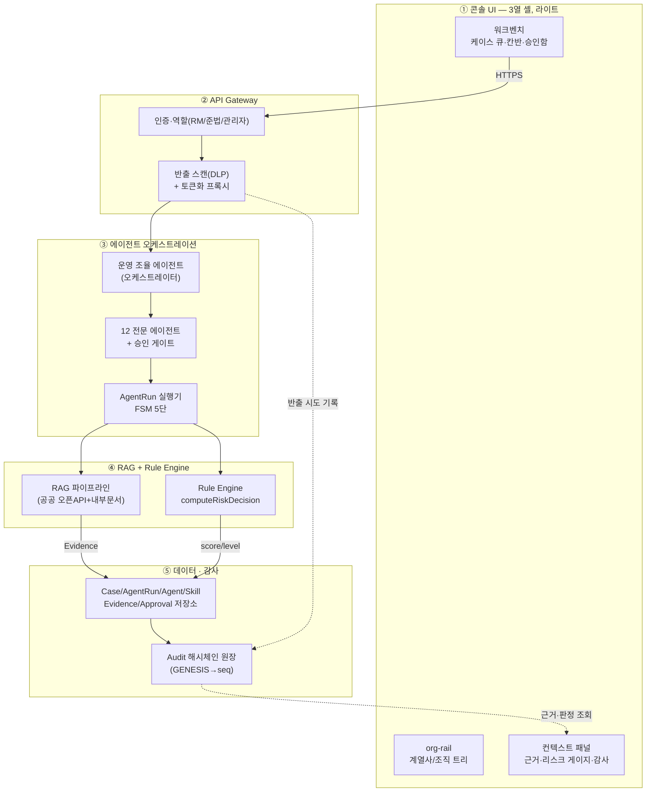
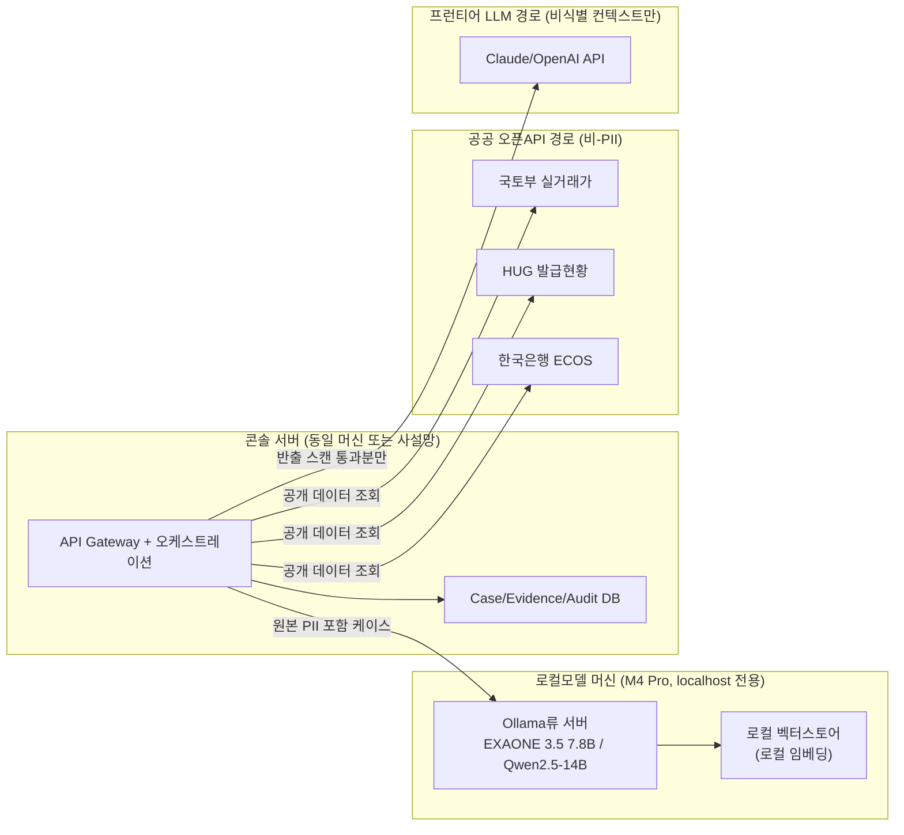

---
tags:
  - area/product
  - type/spec
  - status/draft
date: 2026-07-03
up: "[[INDEX|제품 인덱스]]"
aliases:
  - 기술-아키텍처
  - architecture
---

# 기술 아키텍처

> 신뢰마커: **[확정]** = canon/kernel 고정 사실 · **[조건부]** = 회의·리서치로 방향은 섰으나 최종 미확정 · **(TBD)** = 아직 결정 안 됨.
> SSOT: [[JB-콘솔-프로토타입-스펙-가안|JB 콘솔 프로토타입 스펙]] · [[_canon|예선 canon]] §8·§9 · [[08_본선/03_제품/04_tech/data-model|데이터 모델]] · [[08_본선/03_제품/04_tech/api-spec|API 명세]].

---

## 0. 전제 — 무엇을 승격하는가

현재 라이브 MVP(`02_제품/app/`)는 서버 없이 브라우저 `localStorage`(`jb-localguard-os-state-v2`)로 `Case → AgentRun → Agent → Skill → Evidence → Approval → Audit` 7단 운영 계약을 재현한다 **[확정]**(canon §8·§9). 본선 아키텍처는 이 정적 상태를 지우고 새로 짜는 게 아니라, `app.js`의 4개 함수 계약(`computeRiskDecision`·`buildDashboardData`·`auditChainRecords`·`moveCaseToColumn`)을 서버 API로 **1:1 승격**하고, 그 위에 RAG·Rule Engine·멀티 에이전트 오케스트레이션을 얹는 것이다 **[확정]**(canon §9).

> 참고: 별도 격리 fork `jb-console`([[JB-콘솔-프로토타입-스펙-가안]])가 이 승격의 UI/데이터 스키마 프로토타입 레인이다. paperclip(MIT) 소스 티어다운([[08_본선/_분석/paperclip-소스-티어다운]])이 실측한 매핑 — `issues→Case`·`heartbeatRuns→AgentRun`·`agents→Agent`·`companySkills→Skill`·`issueWorkProducts→Evidence`·`approvals/issueApprovals→Approval`·`activityLog+heartbeatRunEvents→Audit`(+보너스 `budgetPolicies/costEvents`=토큰 예산 통제) — 는 우리 7단 계약이 실제 서비스 스키마로 검증 가능하다는 근거로만 인용한다. **런타임(React/Express/Drizzle·Postgres/WebSocket)은 리프트하지 않는다** — 참고용 상태기계·스키마 명명 패턴만 차용.

---

## 1. 시스템 레이어

### ① 콘솔 UI (3열 셸, 라이트)
- **책임**: RM/준법 담당자가 케이스를 조회·승인하는 유일한 사람 접점. 승인 전 자동 발송 UI를 노출하지 않는다(신뢰보정 UX — [[08_본선/03_제품/06_build-roadmap/P4-UI-조직도-콘솔|P4]]).
- **구성**: `index.html`의 명명된 마운트 포인트(`org-rail`·`nav-list`·`#page-content`·`#context-panel`)를 그대로 승격 기준으로 삼는다 — org-rail(계열사·조직도), 워크벤치(케이스 리스트/칸반/승인함/실행이력), 컨텍스트 패널(근거·리스크 게이지·감사 체인 뷰).
- **인터페이스**: API Gateway에 HTTPS REST + AgentRun 로그는 SSE(`GET /api/runs/:id/stream`, [[08_본선/03_제품/04_tech/api-spec|api-spec]] 씨앗) 구독.
- **현행 → 승격**: 현재 vanilla JS 문자열 템플릿 렌더링 **[확정]**(라이브 MVP). 프레임워크 승격 여부는 (TBD) — P0 DB 범위 결정([[08_본선/03_제품/06_build-roadmap/P0-정의-합의]])에 종속.

### ② API Gateway (인증 · PII 반출 스캔)
- **책임**: 모든 요청의 인증/역할 검사, 그리고 **아웃바운드 방향**(콘솔→외부 프런티어 LLM/외부 API)에 대한 반출 스캔(DLP)과 토큰화 프록시 통과를 강제하는 단일 관문.
- **인터페이스**: 콘솔에는 REST(`/api/cases`, `/api/approvals` 등, [[08_본선/03_제품/04_tech/api-spec|api-spec]] 초안과 정합), 오케스트레이션 레이어에는 내부 호출(AgentRun 시작 트리거).
- **PII 4중 방어 중 여기서 걸리는 것**: ②토큰화(원본 PII↔토큰 키 분리보관, P1 "토큰화 프록시" 개념 — [[08_본선/03_제품/06_build-roadmap/P1-데이터-연동기반]]) + ④반출 스캔(외부 LLM 호출 직전 페이로드 PII 패턴 검사, 위반 시 차단·Audit 기록).

### ③ 에이전트 오케스트레이션 (14 에이전트, AgentRun 실행)
- **책임**: 운영 조율 에이전트(LocalGuard Orchestrator)가 케이스를 라우팅해 12개 전문 에이전트에 스킬을 붙여 실행시키고, `Human RM Lead`·`Human Compliance Lead` 2 사람 승인자와 승인 게이트를 통해서만 고객 대상 행동을 통과시킨다 **[확정]**(canon §2·§8).
- **실행 단위**: AgentRun — FSM 5단 상태(`running/pending/done/blocked/idle`, agent-roster.md 씨앗)로 관리. 1 AgentRun = 1+ Skill 호출 = 1+ Evidence 생성.
- **인터페이스**: RAG+Rule Engine 레이어에 스킬 호출(SK-04 규정 검색 RAG, computeRiskDecision Rule 등, [[08_본선/03_제품/02_agent-design/skill-spec|skill-spec]]), 데이터 레이어에 AgentRun/Evidence 쓰기.
- **PII 4중 방어 중 여기서 걸리는 것**: ③모델 라우팅 — 스킬별 입력 민감도(`public/internal/confidential/restricted`)를 보고 로컬모델(원본 PII 처리 가능) vs 프런티어 LLM(비식별 컨텍스트만)으로 분기. 현재 MVP `modules.js`에 이미 "작업 민감도에 따른 모델 라우팅" 주석과 거버넌스 패널로 프로토타이핑되어 있다(라인 84·139).

### ④ RAG + Rule Engine
- **책임**: 판단에 근거를 붙이는 두 축. RAG는 공공 오픈API·내부 문서에서 근거를 검색해 Evidence로 만들고, Rule Engine은 `computeRiskDecision`의 신호 5종×가중치 계산으로 승인 레벨(L0~L4)을 라우팅한다. 상세는 [[08_본선/03_제품/04_tech/rag-rule-engine|rag-rule-engine.md]].
- **인터페이스**: 벡터스토어(검색) + 규칙 테이블(승인 매트릭스, `app.js` `approvalLevelMatrix`) → 오케스트레이션 레이어로 결과 반환 → Evidence/Approval 레코드 생성.
- **PII 4중 방어 중 여기서 걸리는 것**: ①데이터 등급제 — RAG 소스 수집 시점에 `[public]/[internal]/[confidential]/[restricted]` 등급을 태깅(`skillContent`에 이미 이 표기가 실존, 예: `jb-db` 커넥터는 `govTier: "restricted"`).

### ⑤ 데이터 · 감사 (해시체인 원장)
- **책임**: Case/AgentRun/Agent/Skill/Evidence/Approval 7단 계약의 영속 저장 + Audit을 GENESIS→seq 해시체인으로 기록해 무결성 검증 가능하게 유지한다. `auditChainRecords(item)`의 `{seq·time·actor·action·target·evidenceId·previousHash·hash}` 구조를 그대로 서버 테이블 스키마로 승격.
- **인터페이스**: 모든 상위 레이어의 쓰기 이벤트를 append-only로 수신. 컨텍스트 패널(레이어 ①)에는 조회 전용 API로만 노출.
- **PII 4중 방어 중 여기서 걸리는 것**: ④반출 스캔의 결과(허용/차단)와 ①등급제 태그 변경 이력이 모두 Audit에 남는다 — "감사원장"이 4중 방어의 마지막 축인 이유.

---

## 2. 기술 스택

| 레이어 | 현재/후보 | 신뢰마커 | 비고 |
|---|---|---|---|
| 프런트엔드 | Vanilla JS/HTML/CSS (`02_제품/app/`), Pretendard, 8px radius | **[확정]** | 라이브 MVP. 프레임워크 승격(React 등)은 (TBD) — [[08_본선/_분석/paperclip-소스-티어다운\|paperclip 티어다운]]은 토큰 택소노미·컴포넌트 해부만 참고 대상으로 판정(런타임 미차용) |
| API | FastAPI(Python, MIT) 후보 | **[조건부]** | [[05_리서치/data-api-license-inventory\|라이선스 인벤토리]] B/C 섹션에 후보로 등재. Node/Express 대안도 (TBD) — P0 DB 범위 결정 전까지 확정 보류 |
| 오케스트레이션 | 자체 FSM 기반 오케스트레이터(AgentRun 상태기계) | **[조건부]** | LangGraph/AutoGen류 프레임워크 채택 여부는 (TBD). paperclip `heartbeatRuns`/budget 게이트/approval wakeup 패턴은 "행위 모델 참고"로만 인용(런타임 미차용) |
| 로컬모델 서빙 | Ollama류 서버 + EXAONE 3.5 7.8B / Qwen2.5-14B, M4 Pro | **[조건부]**(kernel 권장) | 최종 테스트 이승보 PC·localhost 전용 **[확정]**. 원본 PII는 반드시 이 경로에서만 처리 |
| 프런티어 LLM 경로 | Claude API / OpenAI API — 비식별 컨텍스트만 | **[확정]**(정책) / 사업자 (TBD) | [[05_리서치/data-api-license-inventory\|라이선스 인벤토리]] B — 학습 미사용 보장과 무관하게 원본 PII 반출 자체가 국외이전이라 금지 |
| 벡터스토어 | (TBD) — 로컬 임베딩 우선 원칙만 확정 | **[조건부]** | 후보: 경량 로컬(sqlite-vec/Chroma) vs pgvector(DB가 Postgres로 확정될 경우). 임베딩 모델도 로컬 서빙 원칙 — 외부 임베딩 API 미사용 |
| DB | PostgreSQL(MIT 계열 permissive) 후보 vs 현행 `localStorage` 유지 | **[조건부]** | [[08_본선/03_제품/06_build-roadmap/P0-정의-합의\|P0]] 옵션 A(정적/로컬)／B(서버API+영속DB)／C(하이브리드) 미확정. 감사원장은 append-only 테이블 또는 별도 immutable log store 필요(옵션과 무관하게 고정 요건) |
| 실시간 통신 | SSE(`GET /api/runs/:id/stream`) | **[조건부]** | api-spec.md 씨앗과 정합. WebSocket 대안은 (TBD) |

---

## 3. PII 4중 방어 — 레이어 배치 요약

| 방어 축 | 어디서 걸리는가 | 무엇을 하는가 |
|---|---|---|
| ①데이터 등급제 | RAG 수집기 + jb-db 커넥터 (레이어④) | 소스 문서/필드에 `public/internal/confidential/restricted` 태깅. `jb-db` 커넥터는 `govTier: "restricted"`로 이미 표기됨(`modules.js` 326행대) |
| ②토큰화 | API Gateway 진입점 (레이어②) | Case 생성 시 원본 PII를 토큰으로 치환, 토큰↔원본 키는 분리보관(P1 "토큰화 프록시") — 신용정보법 §40조의2 ①②⑧ 근거 |
| ③모델 라우팅 | 에이전트 오케스트레이션 (레이어③) | 스킬 입력 등급을 보고 로컬모델(원본 처리) vs 프런티어(비식별만) 분기 |
| ④반출 스캔+감사원장 | API Gateway 아웃바운드 (레이어②) + 데이터·감사 (레이어⑤) | 외부 LLM 호출 직전 DLP 스캔 → 허용/차단 판정을 Audit 해시체인에 기록 |

법령 근거는 canon §4를 그대로 인용한다 — 신용정보법 §40조의2(①②⑥⑦⑧)가 1차 근거, 개인정보보호법 §28조의4·5가 보충 근거 **[확정]**.

---

## 4. 하이브리드 배포 구성

- **원칙**: 로컬모델 머신이 원본 PII를 다루는 유일한 지점 **[확정]**(kernel). 콘솔 서버와 물리적으로 같은 사설망(localhost)에 둔다 — 최종 검증은 이승보 PC 기준.
- **공공 오픈API 경로**: 국토부 실거래가·HUG 발급현황·ECOS 등은 그 자체로 비-PII 통계/시세 데이터라 아웃바운드 반출 스캔 대상이 아니다. 다만 등기정보광장은 일 1,000건·분당 30건 한도([[05_리서치/data-api-license-inventory|라이선스 인벤토리]] D) — 케이스 단위 소량 조회로만 설계.
- **프런티어 LLM 경로**: 반출 스캔을 통과한 비식별 컨텍스트만 전달. HyperCLOVA X 뉴로클라우드(온프레) 대안도 후보(TBD, JB-네이버클라우드 MOU 방향과 정합).

---

## 5. 함수 계약 → 서버 API 승격 매핑

| `app.js` 함수 | 위치 | 승격 대상 API | 담당 레이어 | 비고 |
|---|---|---|---|---|
| `computeRiskDecision(item)` | app.js:4936 | (신규) `GET/POST /api/cases/:id/risk-decision` | ④ Rule Engine | api-spec.md 초안에 아직 없음 — **갭**. 신호 5종×가중치·L0~L4 라우팅 로직은 [[08_본선/03_제품/04_tech/rag-rule-engine\|rag-rule-engine.md]] §3 참고 |
| `buildDashboardData()` | app.js:4857 | (신규, api-spec.md 부재) `GET /api/dashboard` | ⑤ 데이터·감사 (집계 뷰) | 고위험·전세위험·차단·승인대기·근거연결률·예산/ROI·지점별 집계 |
| `auditChainRecords(item)` | app.js:4743 | `GET /api/audit?entity_id=:id` | ⑤ 데이터·감사 (해시체인 원장) | api-spec.md 초안과 이름 정합. GENESIS→seq 해시체인 그대로 승격 |
| `moveCaseToColumn(caseId, column)` | app.js:5597 | `PATCH /api/cases/:id` | ② Gateway → ③ 오케스트레이션(AgentRun 트리거 훅) | api-spec.md 초안과 정합. 칸반 상태전이 시 AgentRun 시작·산출물 생성·감사 훅이 함께 실행되어야 함 |

> **어긋난 점 플래그**: `data-model.md`/`api-spec.md`/`04_erd.md`는 06-26 시점 4엔티티(Case/AgentRun/Approval/AuditEvent) 브레인스토밍 스텁에 아직 머물러 있다. 반면 [[08_본선/03_제품/06_build-roadmap/P2-에이전트-스킬-메모리|P2 빌드로드맵]]과 canon §8은 이미 7단(+Agent+Skill+Evidence)을 확정 계약으로 못 박았다. 이 문서는 kernel(7단)을 따랐다 — data-model.md/api-spec.md가 4엔티티로 남아 있다면 Agent/Skill/Evidence 3개 엔티티와 `risk-decision`/`dashboard` 2개 엔드포인트가 누락된 것이니 조율이 필요하다.

---

## 6. 확장성 서사 — 계열사 추가

현재 확정 스코프는 전북은행 + JB우리캐피탈 2개 계열사, 여신·전세·피싱 3도메인이다 **[확정]**(kernel). 아키텍처적으로 확장은 새 레이어를 만드는 게 아니라:

1. **데이터**: Case/Agent/Evidence 등 7단 엔티티 전체에 `company_id`(계열사 식별자) 필드를 부착 — 멀티테넌시를 스키마 레벨에서 이미 준비.
2. **UI**: 레이어①의 org-rail에 계열사 노드 1개 추가 — 워크벤치·컨텍스트 패널은 `company_id` 필터만으로 재사용.
3. **에이전트**: 계열사별 전용 에이전트가 필요하면(예: JB우리캐피탈 캐피탈 심사 특화) 레이어③에 서브에이전트를 추가하되, 운영 조율 에이전트·승인 게이트 구조는 불변.

JB우리캐피탈 확장 조사는 이미 [[08_본선/03_제품/07_계열사-하네스/_HARNESS-WOORICAP|계열사 하네스]]에 축적돼 있어, 광주은행 등 추가 확장 시에도 같은 패턴(조직도·요구해결맵·업무처리기술 문서화 후 org-rail 노드 추가)을 반복하면 된다.

---

## 참조

- [[JB-콘솔-프로토타입-스펙-가안|JB 콘솔 프로토타입 스펙]] — 콘솔 SSOT
- [[_canon|예선 canon]] §0·§8·§9
- [[08_본선/03_제품/04_tech/data-model|데이터 모델]]
- [[08_본선/03_제품/04_tech/api-spec|API 명세]]
- [[08_본선/03_제품/04_tech/rag-rule-engine|RAG·규칙 엔진]]
- [[08_본선/_분석/paperclip-소스-티어다운|paperclip 소스 티어다운]] — 7단 계약 스키마 검증 참고(런타임 미차용)
- [[08_본선/03_제품/06_build-roadmap/P0-정의-합의|P0 정의 합의]] · [[08_본선/03_제품/06_build-roadmap/P3-보안-거버넌스|P3 보안 거버넌스]] · [[08_본선/03_제품/06_build-roadmap/P5-통합-로컬모델-시연|P5 통합 로컬모델 시연]]
- [[_체계/본선-백엔드-실연동-설계|본선 백엔드 실연동 설계]] *(대상 문서 미작성 — 향후 채워질 예정, dangling)*
- [[08_본선/03_제품/05_diagrams/99_comprehensive-architecture|종합 아키텍처]]
