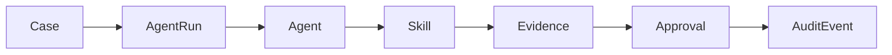
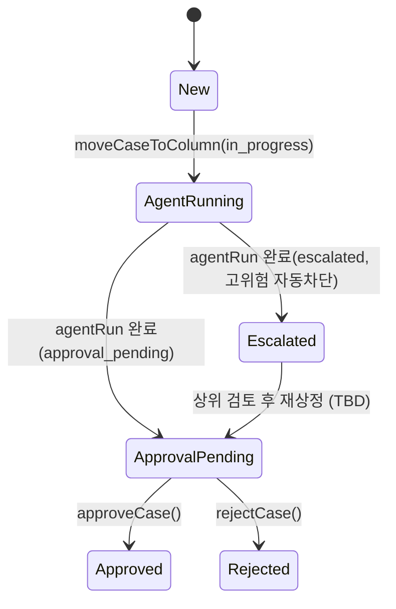
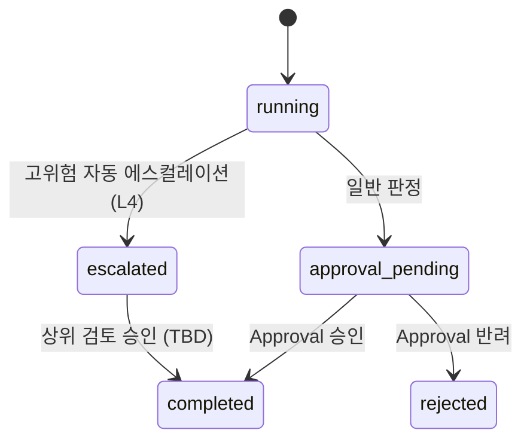
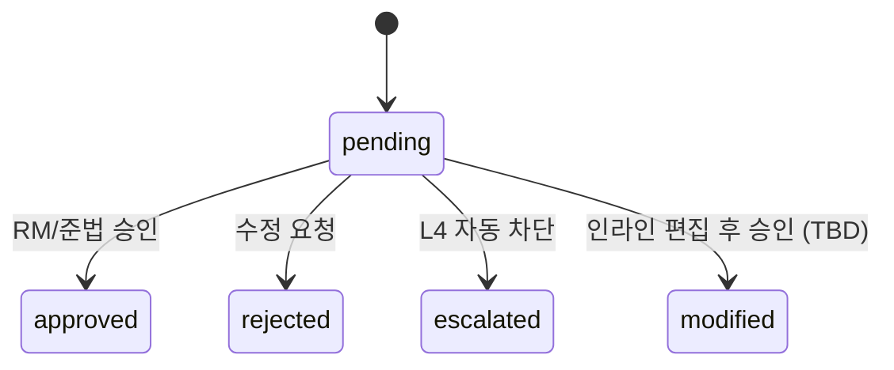
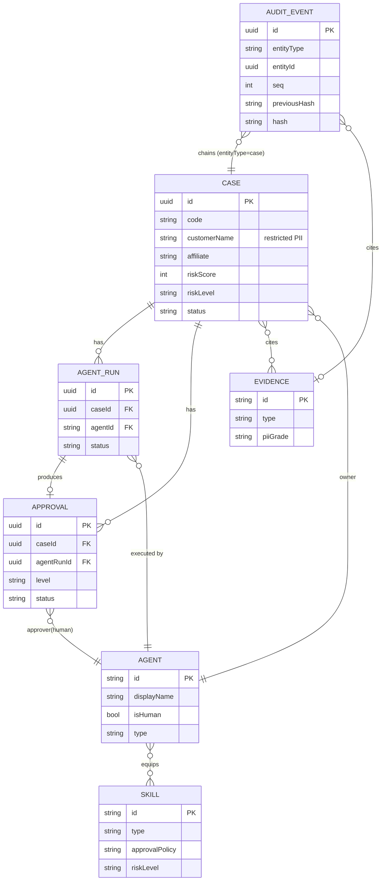

---
tags:
  - area/product
  - type/spec
  - status/draft
date: 2026-07-03
up: "[[INDEX|제품 인덱스]]"
---

# 데이터 모델

> 신뢰마커: **[확정]** = `02_제품/app/app.js`·`modules.js` 소스 또는 `_canon.md`에서 직접 확인. **[조건부]** = 본선 설계 제안(코드 미검증). **(TBD)** = 미정, 구현 단계에서 확정.

이 문서는 MVP(`02_제품/app/`)의 인메모리 상태 모델을 본선 목표 — 정적 함수 계약의 서버 API 1:1 승격 — 을 뒷받침하는 데이터 모델로 승격한 설계다. 운영 계약 7단계를 그대로 7개 엔티티로 매핑한다.

- SSOT: [[JB-콘솔-프로토타입-스펙-가안|콘솔 프로토타입 스펙]] (4 함수계약 위치·시그니처), `_canon.md` §8(운영 계약)·§9(기술 스택)
- 자매 문서: [[08_본선/03_제품/04_tech/api-spec|API 명세]]

---

## 0. 설계 원칙

### 0.1 운영 계약 7단계



고객 대상 행동은 **Approval 통과 전 자동 실행 금지** [확정, canon §8]. Skill은 Agent에 장착되어 실행되고, 산출물은 Evidence로 연결되며, 모든 상태 변경은 AuditEvent로 귀결된다.

### 0.2 PII 등급 4단계 (토큰화 대상 판정)

MVP `dataGovernance.tiers`(`modules.js:54-61`)에서 직접 확인된 등급 체계 [확정]:

| 등급 | 정의 | 예시 필드 | 외부(클라우드 LLM) 전송 |
|---|---|---|---|
| `restricted` | 직접 식별정보 | 성명·주민번호·계좌·전화·주소 | **금지** — 토큰화 필수, on-prem/로컬 모델만 |
| `confidential` | 민감 금융 수치 | 매출·대출잔액·DSR | 범위화·비식별 처리 후에만 가능 |
| `internal` | 내부 운영 메타 | 케이스코드·riskScore·status | 원문 전송 가능(사내 시스템 간) |
| `public` | 공개 정보 | 법령·정책·뉴스 기사 | 제한 없음 |

이하 모든 엔티티 필드표에 **PII** 열로 표시하며, `restricted`/`confidential` 필드는 "토큰화 대상"이다.

### 0.3 리스크 레벨 L0~L4 (승인 라우팅)

MVP `approvalLevelMatrix`(`app.js:702-708`) 그대로 [확정]:

| 레벨 | 점수 구간 | 승인 주체 | 의미 |
|---|---|---|---|
| L0 | 0–39 | 자동(기록만) | 위험 낮음 — 내부 기록만 |
| L1 | 40–59 | RM | 단순 안내 가능 — RM 검토 후 승인 |
| L2 | 60–79 | RM | 고객 영향 있음 — RM 편집 후 발송 |
| L3 | 80–89 | 준법 | 금융·계약 리스크 높음 — RM+준법 승인 |
| L4 | 90–100 | 준법/상위 검토 (TBD, 정본 미지정 역할) | 치명 리스크 — 승인 전 발송 보류/차단 |

라우팅 문구는 `actionType`(`contract`\|`fraud`\|`customerNotice`\|`internal`)별로 다르다 — §1.2 참조. **주의(코드 확인)**: `matrix[actionType] || matrix.customerNotice` 이므로 `actionType==="internal"`은 `customerNotice` 열 문구로 폴백한다 — `approvalLevelMatrix`에 `internal` 전용 열이 없다 [확정, `app.js:4969`].

### 0.4 ID 전략

- **Case/AgentRun/Approval/AuditEvent**: 서버 PK는 `UUID`. MVP의 사람이 읽는 식별자(`code` 예 `JBG-104`, `run-001`)는 별도 unique 필드로 보존.
- **Agent/Skill**: PK는 **slug**(예 `cashflow`, `cashflow-stress`) — MVP가 이미 고정 카탈로그로 사용 중이며 무작위 UUID로 바꿀 이유가 없다 [조건부, 설계 판단].
- **Evidence**: PK는 slug(예 `jb-ai-mou`) — MVP와 동일 [확정].

---

## 1. Case

운영 계약의 루트 엔티티. 위험 신호가 모여 케이스가 되고, 모든 AgentRun·Approval·Audit이 여기서 파생된다.

| 필드 | 타입 | 필수 | PII | 설명 |
|---|---|---|---|---|
| `id` | UUID | ✓ | - | PK |
| `code` | string | ✓ | internal | 표시 코드, unique (예 `JBG-104`) [확정] |
| `customerName` | string | ✓ | **restricted** | 고객명 — 토큰화 대상 [확정, `modules.js:56`] |
| `customerId` | UUID (TBD) | - | restricted | 코어뱅킹 고객 마스터 FK. Customer 엔티티는 이번 7종 범위 밖 (TBD) |
| `affiliate` | enum(`전북은행`\|`JB우리캐피탈`) | ✓ | internal | 확정 스코프 2계열사 [확정, SSOT 커널] |
| `segment` | string | ✓ | internal | 고객 세그먼트 (예 `개인사업자`) [확정] |
| `region` | string | ✓ | internal | 지역 (예 `전북 전주`) [확정] |
| `industry` | string | - | internal | 업종 [확정] |
| `exposure` | string | - | confidential | 노출 요약 텍스트 (예 `운전자금 1.8억 · 카드매출 둔화`) [확정] |
| `primaryPain` | string | - | internal | 핵심 pain 요약 [확정] |
| `riskScore` | int (0–100) | ✓ | internal | 최신 `computeRiskDecision` 점수 캐시 [확정] |
| `riskLevel` | enum(`L0`\|`L1`\|`L2`\|`L3`\|`L4`) | ✓ | internal | `riskScore` 파생, §0.3 매트릭스 적용 |
| `actionType` | enum(`contract`\|`fraud`\|`customerNotice`\|`internal`) | ✓ | internal | 신호 세트 선택 키, `actionTypeForCase()` 파생 [확정, `app.js:4921-4926`] |
| `riskSignals` | RiskSignal[] (embedded) | - | - | 최신 판정의 신호 분해 **캐시** — §1.2 |
| `status` | enum(`New`\|`Agent Running`\|`Approval Pending`\|`Escalated`\|`Approved`\|`Rejected`) | ✓ | internal | [확정, `app.js` 상태 리터럴 전수 확인] |
| `stage` | enum(`new`\|`in_progress`\|`review`\|`blocked`\|`done`) | ✓ | internal | 칸반 컬럼, `columnToStatus()` 역매핑 [확정, `app.js:1188-1197`] |
| `priority` | enum(`urgent`\|`normal`\|`low`) | - | internal | [확정, 데이터 예시 `urgent`] |
| `owner` | string → Agent.id (FK, TBD 정규화) | - | - | 담당 에이전트. MVP는 표시명 문자열 저장(`"Cashflow Triage Agent"`) — 서버는 `Agent.id` slug로 정규화 필요 [조건부] |
| `sla` | string (duration) | - | - | 예 `2h` [확정] |
| `dueAt` | datetime | - | - | [확정, `due: "오늘 16:00"` 형태 → ISO 변환 필요] |
| `pains` | string[] | - | internal | 위험 신호 태그 (예 `cashflow-stress`) [확정] |
| `rootCauses` | string[] | - | internal | 원인 태그 [확정] |
| `evidenceIds` | UUID[] → Evidence[] | - | - | M:N, §5 |
| `agentIds` | string[] → Agent[] | - | - | 배정된 에이전트 목록 [확정, `item.agents`] |
| `resultSaved` / `resultSavedAt` | bool / datetime | - | - | 분석 결과 저장 여부 [확정] |
| `nextTaskCreated` / `nextTaskAt` | bool / datetime | - | - | 후속 태스크 생성 여부 [확정] |
| `createdAt` / `updatedAt` | datetime | ✓ | - | |

### 1.1 상태 전이



[확정: `moveCaseToColumn`(`app.js:5597-5629`), `approveCase`/`rejectCase`(`app.js:5405-5425`), `startAgentRun` 내 `escalate` 분기(`app.js:5359-5360`)]

### 1.2 RiskSignal (값 객체 — `computeRiskDecision` 신호 5종)

`computeRiskDecision(item)`(`app.js:4936-4978`)의 출력을 구성하는 값 객체. Case는 최신 스냅샷을 `riskSignals`에 **비정규화 캐시**로 들고, 원본(변경 불가) 기록은 AgentRun(§2.1 `decisionSnapshot`)이 소유한다 — 감사 추적성을 위해 판정 시점 스냅샷은 불변이어야 하기 때문.

| 필드 | 타입 | 설명 |
|---|---|---|
| `name` | string | 신호명 (한글, 예 `전세가율`) |
| `value` | string | 표시값 (예 `62%`) |
| `weight` | float (0–1) | actionType별 고정 가중치 |
| `contribution` | int | `round(baseScore × weight)`, 신호별 기여 점수 |
| `sourceTag` | enum(`public`\|`estimate`\|`simulation`) | 근거 신뢰 구분 [확정, `scoreSignal()` 호출 인자] |
| `source` | string | 출처 설명 텍스트 |
| `evidenceId` | UUID → Evidence, nullable | 근거 카드 연결. MVP는 텍스트 `source`만 있고 실제 FK 연결이 없음 — 서버 승격 시 연결 필요 [조건부] |

**actionType별 신호 세트 (가중치 합=1.0)** [확정, `app.js:4941-4965`]:

| actionType | 신호 5종(4종) × 가중치 |
|---|---|
| `contract`(전세) | 전세가율 .34 · 권리관계 .24 · 임차인 자산노출 .18 · 보증보험 요건 확인 필요 .14 · 은행 연계 필요 .10 |
| `fraud`(사기) | 외부 URL·콜백 위험 .34 · 고객 접촉 차단 필요 .28 · AI 악용 사기 신호 .22 · 준법 승인 필요 .16 (4종만, 5번째 없음) |
| `customerNotice`/`internal`(소상공인·내부) | 상환 부담 .32 · 정책금융 후보 검토 필요 .22 · 서류·디지털 장벽 .18 · 근거 연결성 .16 · 고객 안내 영향 .12 |

**⚠️ 설계 노트 [조건부]**: 현재 MVP의 `computeRiskDecision`은 원시 입력값(전세가율%, 상환배수 등)으로부터 점수를 **독립 계산하지 않는다**. `baseScore = item.riskScore`(사전 시드값)를 그대로 받아 신호별 가중치로 **재분배(설명)**할 뿐이다 — 즉 `Σcontribution ≈ baseScore`가 되도록 역산된 "설명 가능성" 함수다. 본선 목표(RAG+Rule Engine)에서는 이걸 뒤집어 **원시 신호 입력 → 독립 점수 산출**로 전환해야 한다. 이 전환이 이번 데이터 모델의 핵심 승격 포인트다.

---

## 2. AgentRun

한 케이스에 대해 하나의 에이전트가 수행한 실행 단위. `startAgentRun()`(`app.js:5320-…`) 기준.

| 필드 | 타입 | 필수 | PII | 설명 |
|---|---|---|---|---|
| `id` | UUID (표시용 `run-001` 유지) | ✓ | - | PK |
| `caseId` | UUID → Case | ✓ | - | FK |
| `caseCode` | string | ✓ | internal | 비정규화 (표시용) [확정] |
| `agentId` | string → Agent.id | ✓ | - | 실행 에이전트. MVP는 `item.owner` 표시명 문자열 저장 — 서버는 slug로 정규화 [조건부] |
| `status` | enum(`running`\|`approval_pending`\|`escalated`\|`completed`\|`rejected`) | ✓ | - | [확정, `runStatusLabel()` 키 전수, `app.js:1007` 부근] |
| `command` | string | ✓ | confidential | 실행 지시 텍스트 (고객 맥락 포함 가능) |
| `log` | AgentRunLogEntry[] (embedded) | - | - | `{time, text}[]` [확정] |
| `decisionSnapshot` | RiskDecision (embedded, 불변) | - | - | 판정 시점 `computeRiskDecision` 전체 출력 — §2.1 |
| `startedAt` | datetime | ✓ | - | |
| `endedAt` | datetime, nullable | - | - | |

### 2.1 RiskDecision (embedded — `computeRiskDecision` 반환값 전체)

| 필드 | 타입 | 설명 |
|---|---|---|
| `score` | int (0–100) | `Σsignal.contribution` |
| `level` | enum(`L0`..`L4`) | §0.3 |
| `route` | string | actionType별 승인 라우팅 문구 |
| `matrixReason` | string | 레벨 사유 텍스트 |
| `actionType` | enum(`contract`\|`fraud`\|`customerNotice`\|`internal`) | |
| `signals` | RiskSignal[] | §1.2, 4~5개 |

### 2.2 상태 전이



---

## 3. Agent (신규)

canon 로스터 — **운영 에이전트 14종 + 사람 승인자 2종** [확정, `_canon.md` §2]. `app.js:147-343` `agents` 배열 전수 확인.

| 필드 | 타입 | 필수 | 설명 |
|---|---|---|---|
| `id` | string (slug, PK) | ✓ | 예 `cashflow`, `jeonse-lead`. 사람 승인자는 `human-rm-lead`/`human-compliance-lead`로 표준화 제안 [조건부] — MVP는 `reportsTo`에 영문 `"Human RM Lead"` 리터럴을 섞어 써서 일관성이 없음 [확정 결함, `app.js:153` vs `agentTeamGroups.owner` 한글 표시명] |
| `internalName` | string | ✓ | 영문 내부명 (canon "내부 영문명", 예 `Cashflow Triage Agent`) |
| `displayName` | string | ✓ | **표시명** — canon 정본 그대로 사용 (예 `상환위험 분류 에이전트`) [확정] |
| `isHuman` | bool | ✓ | 사람 승인자(RM 최종 승인자·준법 최종 승인자) 여부. `false`=AI 에이전트 |
| `type` | enum(`orchestrator`\|`research`\|`finance`\|`risk`\|`communication`\|`compliance`\|`analytics`\|`housing-risk`\|`legal-risk`\|`asset-risk`\|`contract`\|`banking`) | ✓ | [확정, `agents[].type` 전수 12종] |
| `status` | enum(`running`\|`pending_approval`\|`idle`) | ✓ | [확정] |
| `reportsTo` | string → Agent.id (FK, TBD 정규화) | - | 보고 체계. §5 조직도 근거 |
| `approvalLevel` | enum(`L0`..`L4`) (TBD) | - | 이 에이전트가 통상 다루는 승인 레벨 — 콘솔 스펙 로스터 표기(`app.js` 미보유, `08_본선/_분석/JB-콘솔-프로토타입-스펙.md` §canon 참조) [조건부] |
| `budget` | decimal | - | 예산(원) [확정] |
| `spent` | decimal | - | 소진액(원) [확정] |
| `heartbeat` | string | - | 최근 하트비트 (예 `38s`) [확정] |
| `queueDepth` | int | - | 대기 큐 [확정, `queue`] |
| `currentCaseLabel` | string | - | 현재 처리 중 표시 (TBD: Case FK로 정규화 권장) |
| `skillIds` | string[] → Skill[] | - | M:N, §4 |
| `role` | string | - | 역할 설명 텍스트 [확정] |
| `createdAt` / `updatedAt` | datetime | ✓ | |

**14+2 로스터** (canon 표시명, `_canon.md` §2 그대로) — 상세 매핑표는 canon 원본 참조, 여기서는 중복 생성하지 않음.

---

## 4. Skill (신규)

`skillRack`(`app.js:112-145`) + `modules.js` 콘텐츠(md body, 415행 부근) 기준. 25종 스킬 [확정, 콘솔 스펙 §목표 IA "시스템 > 스킬"].

| 필드 | 타입 | 필수 | PII | 설명 |
|---|---|---|---|---|
| `id` | string (slug, PK) | ✓ | - | 예 `cashflow-stress` [확정] |
| `type` | enum(16종: `orchestration`\|`research`\|`reasoning`\|`finance`\|`operations`\|`risk`\|`communication`\|`compliance`\|`control`\|`analytics`\|`jeonse-risk`\|`legal-risk`\|`guarantee`\|`asset-risk`\|`contract`\|`banking`) | ✓ | - | [확정, `skillRack` 전수] |
| `purpose` | string | ✓ | internal | 목적 설명 [확정] |
| `approvalPolicy` | enum(9종: `internal only`\|`RM review`\|`blocks external action`\|`mandatory`\|`approval required`\|`RM approval`\|`human/legal review`\|`legal review`\|`advisor review`) | ✓ | - | 실행 전 요구 승인 [확정, `skillRack` 전수] |
| `riskLevel` | enum(`low`\|`medium`\|`high`) | ✓ | - | [확정] |
| `enabled` | bool | ✓ | - | 사용 여부 [확정] |
| `bodyMd` | text (markdown) | - | - | 스킬 명세 본문 — 목적/입력(데이터 등급)/처리절차/임계값/출력/근거/승인·리스크 구조 [확정, `modules.js` skill body 예시] |
| `inputPiiGrade` | enum(`public`\|`internal`\|`confidential`\|`restricted`) | - | - | `bodyMd` "입력 (데이터 등급)" 섹션에서 파생, 여러 개면 최고 등급 채택 [조건부] |
| `createdAt` / `updatedAt` | datetime | ✓ | - | |

관계: `AgentSkill` 조인 테이블(`agentId`, `skillId`) — M:N, MVP는 `Agent.skills: string[]`로 임베드 [확정].

---

## 5. Evidence (신규)

`const evidence = […]`(`app.js:37-110`) 기준, 8건 시드 [확정].

| 필드 | 타입 | 필수 | PII | 설명 |
|---|---|---|---|---|
| `id` | string (slug, PK) | ✓ | - | 예 `jb-ai-mou` [확정] |
| `type` | enum(`JB Official`\|`News`\|`Policy`\|`Official`) | ✓ | public | [확정, 리터럴 4종 전수] |
| `title` | string | ✓ | public | [확정] |
| `source` | string | ✓ | public | 발행처 [확정] |
| `url` | string (URL) | - | public | [확정] |
| `implication` | string | ✓ | internal | 이 근거가 위험 판단에 갖는 시사점 [확정] |
| `sourceTag` | enum(`public`\|`estimate`\|`simulation`) | - | - | RiskSignal에서 참조하는 신뢰 구분과 동일 enum — §1.2 |
| `piiGrade` | enum(`public`\|`internal`\|`confidential`\|`restricted`) | ✓ | - | 근거 콘텐츠 자체의 PII 등급. 시드 8건은 전부 `public`(외부 공개자료) [확정]; 상담 메모 등 내부 근거가 들어오면 `confidential`/`restricted` 가능 (TBD, 상담메모 근거 타입 미구현) |
| `createdAt` | datetime | ✓ | - | |

관계: `Case.evidenceIds[]` — M:N(현재는 Case→Evidence 배열만, 역방향 조회는 `casesByEvidence()`로 스캔) [확정, `app.js:1168-1169`]. `AuditEvent.evidenceId` — 1:N(§7).

---

## 6. Approval

기존 초안 필드 유지 + L0~L4/게이트 체크 보강.

| 필드 | 타입 | 필수 | 설명 |
|---|---|---|---|
| `id` | UUID | ✓ | PK |
| `caseId` | UUID → Case | ✓ | FK |
| `agentRunId` | UUID → AgentRun | ✓ | FK |
| `level` | enum(`L0`..`L4`) | ✓ | `decisionSnapshot.level` 복사 — 승인 라우팅 근거 |
| `levelReason` | string | - | `matrixReason` 복사 |
| `actionDraft` | string | ✓ | 승인 대상 행동 초안 텍스트 |
| `status` | enum(`pending`\|`approved`\|`rejected`\|`escalated`\|`modified`) | ✓ | `escalated`=L4 자동 에스컬레이션 경로 [확정, `startAgentRun` escalate 분기]; `modified`=인라인 편집 후 승인(TBD, MVP 미구현 — 원 초안 필드 보존) |
| `approverRole` | enum(`system`\|`RM`\|`준법`\|`상위검토(TBD)`) | ✓ | L0=system 자동, L1/L2=RM, L3=준법, L4=(TBD, 정본 미지정) — §0.3 |
| `approverId` | string → Agent.id (human) | - | `human-rm-lead` \| `human-compliance-lead` |
| `approvedAt` | datetime, nullable | - | |
| `gateChecks` | GateCheck[] (embedded) | - | `{name, status: passed\|pending\|blocked}[]` — MVP `item.gates` 튜플 배열 그대로 [확정, `app.js` 초기 케이스 데이터 `gates: [[...]]`] |
| `rejectionAlternative` | string | - | 반려 시 대체 조치 문구 (`createAnalysisResult().rejectionAlternative`) [확정] |
| `createdAt` | datetime | ✓ | |

### 6.1 상태 전이



---

## 7. AuditEvent

`auditChainRecords(item)`(`app.js:4743-4758`) 기준 — **GENESIS 해시체인**.

| 필드 | 타입 | 필수 | 설명 |
|---|---|---|---|
| `id` | UUID | ✓ | PK (서버 내부용, 체인 무결성과 무관) |
| `entityType` | enum(`case`\|`agent_run`\|`approval`) | ✓ | 원 초안 필드 보존 — 어떤 엔티티의 체인인지. MVP는 `case`만 실제 구현 [확정] |
| `entityId` | UUID | ✓ | `entityType`이 가리키는 대상 PK |
| `seq` | int | ✓ | **체인은 `(entityType, entityId)` 단위로 파티션**, 1부터 시작 [확정] |
| `time` | datetime | ✓ | |
| `actor` | enum(`사람`\|`오케스트레이터`\|`AI 업무지원`) | ✓ | `inferAuditActor()` 정규식 추론 — `RM\|담당자\|reviewer\|검토 담당자`→사람, `사용자 입력\|콘솔\|보드\|오케스트레이터\|LocalGuard`→오케스트레이터, 그 외→AI 업무지원 [확정, `app.js:4760-4765`] |
| `actorId` | string → Agent.id, nullable (TBD) | - | MVP는 카테고리만 추론하고 특정 행위자 ID를 기록하지 않음 — 서버 승격 시 추가 필요 |
| `action` | string | ✓ | 행위 설명 텍스트 |
| `target` | string | ✓ | 비정규화된 `Case.code` [확정] |
| `evidenceId` | string → Evidence, nullable | - | 없으면 `"internal-event"` 리터럴 [확정] |
| `payload` | JSON | - | 원 초안 필드 보존 — 해시 입력에는 `{seq,time,actor,action,target,evidenceId,previousHash}`만 사용, `payload`는 부가 컨텍스트용 (TBD 스키마) |
| `previousHash` | string | ✓ | 첫 레코드는 리터럴 `"GENESIS"` [확정] |
| `hash` | string | ✓ | 아래 §7.1 알고리즘 |
| `createdAt` | datetime | ✓ | |

### 7.1 해시체인 알고리즘 [확정, `app.js:4734-4757`]

```
payload_i = JSON.stringify({ seq, time, actor, action, target, evidenceId, previousHash: hash_{i-1} })
hash_i    = simpleHash(payload_i)        // MVP: FNV-1a 32bit, 8자리 hex — 비암호학적
previousHash_1 = "GENESIS"
```

**무결성 검증** (`verifyAuditChain()`): 모든 `i>0`에 대해 `record[i].previousHash === record[i-1].hash`이면 정상.

**⚠️ 서버 승격 필수 사항 [조건부]**: MVP의 `simpleHash`는 FNV-1a 32bit(비암호학적, 충돌 저항 없음) — 데모 UI 무결성 표시용으로만 적합하다. 본선 서버는 `hash = SHA-256(payload)`로 교체해야 실질적 위변조 저항성을 갖는다. 체인 구조(GENESIS 시작, `previousHash` 연결)는 동일하게 유지.

---

## 8. 종합 ERD



> 기존 [[08_본선/03_제품/05_diagrams/04_erd|ERD 다이어그램]] 스텁은 Case/AgentRun/Approval/AuditEvent 4종만 담고 있다 — Agent/Skill/Evidence 반영 재작성 필요(TBD, 이 문서 범위 밖).

---

## 9. MVP → 서버 필드 매핑 (발췌)

| 개념 | MVP (app.js/modules.js) | 서버 모델 |
|---|---|---|
| 케이스 위험 점수 | `item.riskScore`(시드 상수) | `Case.riskScore`(Rule Engine 산출로 전환 목표) |
| 판정 신호 분해 | `computeRiskDecision(item).signals` | `RiskSignal[]`(§1.2), 원본은 `AgentRun.decisionSnapshot` |
| 대시보드 집계 | `buildDashboardData()` 반환 객체 | `GET /api/v1/dashboard` 응답 — [[08_본선/03_제품/04_tech/api-spec|API 명세]] §3 |
| 감사 체인 | `auditChainRecords(item)` | `AuditEvent[]`(entityType=`case`) |
| 칸반 이동 | `moveCaseToColumn(caseId, column)` | `PATCH /api/v1/cases/:id/column` |
| PII 등급 | `dataGovernance.tiers` | §0.2 PiiGrade enum, `Evidence.piiGrade`/`Skill.inputPiiGrade` |
| 에이전트 로스터 | `agents`(14) + `agentTeamGroups.owner`(사람 2) | `Agent`(§3), `isHuman` 플래그로 통합 |

---

## 10. 남은 TBD

- `Customer` 마스터 엔티티 (코어뱅킹 연동 시점까지 `Case.customerId`는 미정)
- `Agent.approvalLevel`, `Agent.reportsTo`/`Case.owner`/`AgentRun.agentId`의 slug 정규화 (MVP는 표시명 문자열 혼용)
- L4 승인 주체("상위 검토") 구체 역할 — canon 미지정
- `RiskSignal.evidenceId` 실제 FK 연결(MVP는 텍스트 `source`만 존재)
- `Skill.inputPiiGrade` 자동 파생 규칙(현재는 `bodyMd` 자유 텍스트 파싱 필요)
- `AuditEvent.actorId` 특정 행위자 ID (MVP는 정규식 카테고리 추론만)
- 해시 알고리즘 SHA-256 교체, 서명(비대칭키) 여부
- computeRiskDecision을 "설명 함수"에서 "독립 산출 Rule Engine"으로 전환하는 원시 입력 스키마

---

## 참조

- [[JB-콘솔-프로토타입-스펙-가안|콘솔 프로토타입 스펙(SSOT)]] — 4 함수계약, canon 에이전트 정본, 데모 시나리오
- `_canon.md` §2(에이전트 로스터)·§8(운영 계약)·§9(기술 스택) — 프로젝트 루트, 예선 워크스페이스 SSOT
- [[08_본선/03_제품/04_tech/api-spec|API 명세]]
- [[08_본선/03_제품/05_diagrams/04_erd|ERD 다이어그램]] (재작성 필요, TBD)
- [[08_본선/03_제품/04_tech/architecture|기술 아키텍처]] · [[08_본선/03_제품/04_tech/rag-rule-engine|RAG·규칙 엔진]] (스텁, 별도 갱신 필요)
- `_체계/본선-백엔드-실연동-설계.md` — Node.js+TypeScript, SQLite, 계약 4함수 서버 이관 방향(미구현, 착수 시 사용자 승인 필요)
