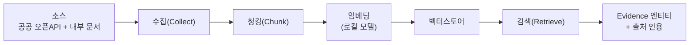
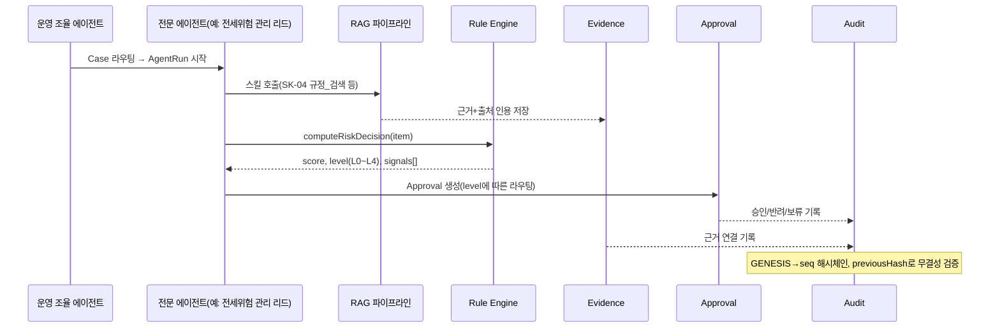

---
tags:
  - area/product
  - type/spec
  - status/draft
date: 2026-07-03
up: "[[INDEX|제품 인덱스]]"
aliases:
  - RAG-규칙엔진
  - rag-rule-engine
---

# RAG·규칙 엔진

> 신뢰마커: **[확정]** = canon/kernel·`app.js` 실코드 근거 · **[조건부]** = 방향은 섰으나 최종 미확정 · **(TBD)** = 아직 결정 안 됨.
> SSOT: [[JB-콘솔-프로토타입-스펙-가안|JB 콘솔 프로토타입 스펙]] · [[_canon|예선 canon]] §4·§8·§9 · [[08_본선/03_제품/04_tech/architecture|기술 아키텍처]].

---

## 1. 역할 — RAG와 Rule Engine은 왜 둘 다 필요한가

에이전트가 "결론만이 아니라 근거·불확실성·다음 확인 항목"을 남기려면(canon §8) 두 축이 함께 필요하다 **[확정]**.

- **RAG**: 정성적 근거 조달. 법령·정책·시세·상권 등 텍스트/수치 소스를 검색해 케이스에 **Evidence 엔티티**로 부착한다. "이 판단이 왜 맞는가"를 답한다.
- **Rule Engine**: 정량적 판정. `computeRiskDecision`의 신호 5종×가중치 계산이 RAG가 커버 못 하는 임계값·승인 라우팅을 담당한다. "그래서 누가 승인해야 하는가"를 답한다.

둘 다 AgentRun 안에서 스킬로 호출되고, 결과는 Evidence(RAG)와 score/level(Rule)로 나뉘어 같은 Case에 붙는다 — 아래 §5.

---

## 2. RAG 파이프라인

1. **소스**: A) 공공 오픈API — 국토부 실거래가, HUG 발급현황, 국가법령정보(법령/시행령), 한국은행 ECOS, DART 등([[05_리서치/data-api-license-inventory|라이선스 인벤토리]] A). B) 내부 문서 — JB 금융 DB(거래·상담·심사 이력), 사내 정책·스킬 콘텐츠(`skillContent`).
2. **수집(Collect)**: 공공 API는 케이스 단위 소량 조회(등기정보광장 일 1,000건·분당 30건 한도 등 제약 반영, 대량 크롤링 금지). 내부 문서는 Read-only CDC로 정보계에서 발췌([[08_본선/03_제품/06_build-roadmap/P1-데이터-연동기반|P1]]).
3. **청킹(Chunk)**: 법령 조문 단위, 정책 카드 단위 등 소스 유형별 자연 경계로 분할 (TBD — 청크 크기/오버랩 값 미확정).
4. **임베딩**: **로컬 모델로만 수행** — 원문(특히 `jb-db`처럼 `restricted` 등급 문서)이 외부 임베딩 API로 나가지 않도록 강제 **[확정]**(PII 4중 방어 ①등급제와 직결).
5. **벡터스토어**: (TBD, [[08_본선/03_제품/04_tech/architecture|architecture.md]] §2 참고 — 경량 로컬 vs pgvector).
6. **검색(Retrieve)**: 스킬 호출 시점에 케이스 컨텍스트로 질의 → top-k 근거 반환.
7. **Evidence 부착**: 검색 결과를 원문 그대로 노출하지 않고 **출처 인용 + 요약**으로 Evidence 엔티티에 저장. Evidence는 Approval 화면에서 근거 링크로 노출된다(canon §3 Evidence traceability 100% KPI).

---

## 3. 지식 베이스 카탈로그

라이브 MVP `02_제품/app/modules.js`의 `pluginRegistry`(265행대)가 이미 RAG 소스 카탈로그의 프로토타입이다 **[확정]** — 아래 표는 이를 도메인별로 재정리한 것.

| 도메인 | 커넥터 ID (MVP) | 이름 | 범위 | 등급(govTier) | 상태 |
|---|---|---|---|---|---|
| 공통(준법) | `law-moleg` | 국가법령정보 커넥터 | 개인정보보호법·신용정보법·전자금융감독규정 | public | connected |
| 공통(정책동향) | `policy-assembly` | 국회·금융정책 커넥터 | 국회 의안정보, 금융위 정책, 금융분야 AI 가이드라인 | public | available |
| 여신(소상공인) | `policy-sema` | 소상공인 정책금융 커넥터 | 소진공 정책자금·저금리 대환·지역신용보증재단·햇살론뱅크 | public | connected |
| 여신(소상공인) | `news-local` | 지역경제·상권 뉴스 커넥터 | 전북 자영업 지표, 전주 원도심 상권, 소상공인 경기 | public | connected |
| 여신(소상공인) | `jb-db` | JB 금융 데이터베이스 커넥터 | 고객 거래내역·상담이력·여신 심사 데이터 | **restricted** | available |
| 전세보호 | `realestate-redev` | 재개발·도시정비 커넥터 | 도시정비구역, 재개발·재건축, 상권 변화 | public | available |
| 전세보호 | (TBD, 미등록) | 국토부 아파트 전월세 실거래가 OpenAPI | 전세가율 산정용 시세 | public, 인증키 필요 | (TBD) — [[05_리서치/data-api-license-inventory\|인벤토리]] A |
| 전세보호 | (TBD, 미등록) | HUG 전세보증금반환보증 발급현황 | 보증 가입 가능성 판단 | public(공공누리, 확인 필요) | (TBD) |
| 전세보호 | (TBD, 미등록) | 대법원 등기정보광장 | 권리관계(근저당·신탁) 확인 | 기관 약관, **일 1,000건 한도** | (TBD) — 소량 조회 전제 |
| 피싱차단 | `law-moleg`(재사용) | 국가법령정보 커넥터 | 보이스피싱 관련 조문(간접) | public | connected |
| 피싱차단 | (TBD, 미등록) | 금융위·경찰청 보이스피싱 경보/통계 | 외부 URL·콜백 패턴, 피해 통계 | (TBD) | **[조건부]** — 전세\|피싱 중 1개만 7/4 실동작([[JB-콘솔-프로토타입-스펙-가안\|콘솔 스펙]]) |

> 상용 API/모델(Claude·OpenAI·HyperCLOVA X)과 오픈소스(Playwright·FastAPI·PostgreSQL 등)의 라이선스·제약은 여기서 다루지 않는다 — [[05_리서치/data-api-license-inventory|데이터·API·라이선스 인벤토리]]가 SSOT.

---

## 4. Rule Engine — `computeRiskDecision` 승격 명세

`app.js:4936`의 실제 로직을 그대로 서버 규칙으로 승격한다 **[확정]**. 신호는 케이스의 `actionType`(`actionTypeForCase`, app.js:4921)에 따라 4갈래로 분기하고, 각 신호의 기여도(`contribution = round(baseScore × weight)`)를 합산해 `score`를 만든다.

### 4.1 행동유형별 신호 5종 × 가중치

| actionType | 트리거 조건 | 신호(가중치) |
|---|---|---|
| `contract`(전세) | `pains`에 `jeonse-fraud` | 전세가율(0.34) · 권리관계(0.24) · 임차인 자산노출(0.18) · 보증보험 요건(0.14) · 은행 연계 필요(0.10) |
| `fraud`(사기) | `pains`에 `fraud` 또는 `callback-risk` | 외부 URL·콜백 위험(0.34) · 고객 접촉 차단 필요(0.28) · AI 악용 사기 신호(0.22) · 준법 승인 필요(0.16) |
| `customerNotice`(소상공인 안내) | `pains`에 `policy-match` 또는 `documentation` | 상환 부담(0.32) · 정책금융 후보 검토(0.22) · 서류·디지털 장벽(0.18) · 근거 연결성(0.16) · 고객 안내 영향(0.12) |
| `internal`(기본값) | 위 조건 미해당 | `customerNotice`와 동일 가중치 세트 재사용 |

### 4.2 승인 레벨 라우팅 (`approvalLevelMatrix`, app.js:702)

| 레벨 | 점수 구간 | customerNotice | contract(전세) | fraud(사기) | 사유 |
|---|---|---|---|---|---|
| **L0** | 0–39 | 내부 기록만 | 내부 기록만 | 모니터링 | 위험 낮음 |
| **L1** | 40–59 | RM 검토 후 승인 | RM 확인 | 보안 확인 | 단순 안내 가능 |
| **L2** | 60–79 | RM 편집 후 발송 | 체크리스트 확인 | 고객 접촉 보류 | 고객 영향 있음 |
| **L3** | 80–89 | RM+준법 승인 | 법률/보증 원문 확인 | 보안팀 승인 | 금융·계약 리스크 높음 |
| **L4** | 90–100 | 승인 전 발송 보류 | 사람 결정 전 차단 | 차단 검토 요청 | 치명 리스크 |

- **준법/차단 트리거**: L3부터 준법 최종 승인자(Human Compliance Lead)가 개입, L4는 승인 게이트가 고객 대상 행동을 하드 차단하고 상위 검토로 escalate한다 **[확정]**(canon §8, "고위험 fraud는 외부 접촉 차단").
- 위 테이블은 서버 이관 시 하드코딩 상수가 아니라 **규칙 버전 관리 대상**(임계값 변경 시 Audit에 변경 이력 필요) — 구체 버전 관리 방식은 (TBD).

---

## 5. RAG 근거 + Rule 판단이 AgentRun→Evidence→Approval로 흐르는 경로

1. 오케스트레이터가 Case를 전문 에이전트에 배정하며 AgentRun을 연다.
2. 에이전트는 스킬을 통해 RAG(근거 검색)와 Rule Engine(점수 계산)을 각각 호출한다 — 순서 강제는 없으나 Approval 생성 전에 둘 다 완료되어야 한다.
3. RAG 결과는 Evidence로, Rule 결과는 score/level로 각각 Case에 귀속된다.
4. `level`이 L1 이상이면 Approval 레코드가 생성되고, `approvalLevelMatrix`의 행동유형별 문구가 승인 화면에 그대로 노출된다(예: fraud L4 → "차단 검토 요청").
5. Evidence 부착·Approval 판정·반출 스캔 결과 모두 Audit 해시체인에 순차 기록되어, `auditChainRecords`가 그대로 무결성 검증 가능한 원장을 재구성한다.

---

## 6. PII 안전

- **로컬 임베딩**: 벡터스토어에 들어가는 임베딩은 반드시 로컬 모델(EXAONE 3.5 7.8B / Qwen2.5-14B 등, M4 Pro)로 생성한다 — 원문이 `restricted`(예: `jb-db`)일 경우 외부 임베딩 API 자체가 반출 행위이므로 금지 **[확정]**(PII 4중 방어 원칙, [[08_본선/03_제품/04_tech/architecture|architecture.md]] §3).
- **비식별 후 검색**: 프런티어 LLM이 검색 결과를 "생성"에 활용해야 하는 경우, 검색된 근거 텍스트에서 고객 식별정보를 제거한 뒤에만 컨텍스트로 전달한다 — 신용정보법 §40조의2 ①②⑧, 개인정보보호법 §28조의4 근거(canon §4).
- **Rule Engine은 원본 PII를 다루지 않는다**: `computeRiskDecision`의 입력은 이미 파생 지표(riskScore, ratio, exposureRatio 등)이지 원문 PII가 아니다 — 규칙 계산 자체는 로컬/서버 어디서 돌려도 반출 리스크가 낮다.
- **감사**: RAG 검색·Rule 계산 모두 어떤 소스/모델/처리경로를 썼는지 Audit 로그에 남긴다([[05_리서치/data-api-license-inventory|라이선스 인벤토리]] "3. PII 비반출 거버넌스" 원칙과 동일).

---

## 7. 남은 (TBD)

- 청킹 크기/오버랩, 벡터스토어 제품 선택, 규칙 버전 관리 방식.
- 피싱 도메인 RAG 소스(금융위·경찰청 통계) 커넥터화 — 전세\|피싱 중 1개만 7/4 조건부 실동작이라 우선순위 낮음.
- 국토부 실거래가·HUG·등기정보광장을 `pluginRegistry`에 실제 등록하는 작업(현재는 데이터·API 인벤토리 문서에만 존재, MVP 코드에는 미등록).

---

## 참조

- [[08_본선/03_제품/02_agent-design/skill-spec|스킬 명세]]
- [[08_본선/03_제품/04_tech/architecture|기술 아키텍처]]
- [[JB-콘솔-프로토타입-스펙-가안|JB 콘솔 프로토타입 스펙]]
- [[_canon|예선 canon]] §4·§8·§9
- [[05_리서치/data-api-license-inventory|데이터·API·라이선스 인벤토리]]
- [[08_본선/03_제품/04_tech/data-model|데이터 모델]] · [[08_본선/03_제품/04_tech/api-spec|API 명세]]
