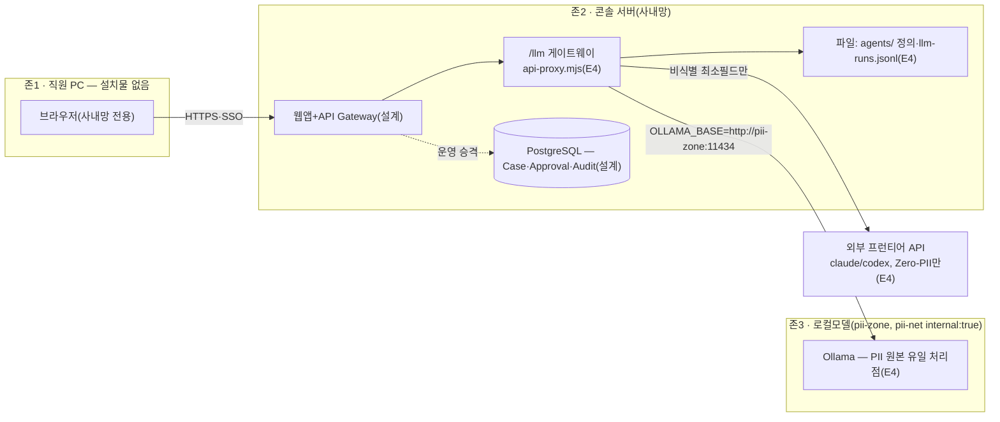

---
tags:
  - area/product
  - type/diagram
  - status/active
date: 2026-07-05
up: "[[INDEX|제품 인덱스]]"
---

# 배포 토폴로지 — 3존 구조

> 이 그림의 주장 = PII 비반출은 네트워크 지점 하나(게이트웨이)로 물리화된다 — 존3(pii-net)은 Docker `internal: true`로 외부 인터넷 라우팅이 원천 차단되고, 직원 PC에는 아무것도 설치되지 않는다.

실선은 `02_제품/deploy/docker-compose.yml`이 실제로 구성하는 경계(console↔pii-zone, pii-net internal)다. 점선(PostgreSQL 승격)은 아직 로컬스토리지 하네스 단계인 설계 구간이다. 게이트웨이가 존2↔존3, 존2↔외부를 잇는 유일한 관문이다.

## 연결
- [[배포-토폴로지-운영-기획서]]
- [[09_policy-engine-gates]]
