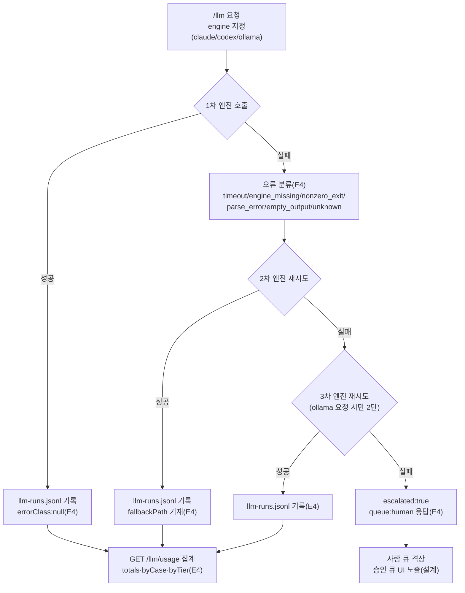

---
tags:
  - area/product
  - type/diagram
  - status/active
date: 2026-07-05
up: "[[INDEX|제품 인덱스]]"
---

# LLM 라우팅 폴백 사다리

> 이 그림의 주장 = AI가 조용히 사라지지 않는다 — 요청 엔진이 실패하면 다음 엔진으로, 그마저 실패하면 반드시 사람 큐로 격상되고 모든 시도가 원장 한 줄로 남는다.

폴백 순서는 claude↔codex↔ollama 중 요청 엔진 기준 최대 3단(`ladderFor`)이며, 매 시도가 JSONL 원장 한 줄로 남는다(`api-proxy.mjs` `handleLlm`). 전부 실패해도 `escalated:true`로 사람 큐에 도착하는 것까지는 실동작하고, 그 건을 승인 큐 화면에 노출하는 UI 연결만 아직 설계 단계다.

## 연결
- [[Q14-오류로깅-폴백사다리]]
- [[09-119-라우팅관측-확장-설계도]]
