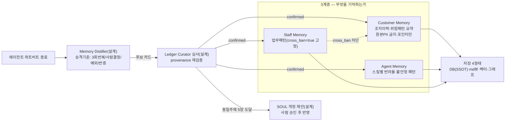

---
tags:
  - area/product
  - type/diagram
  - status/active
date: 2026-07-05
up: "[[INDEX|제품 인덱스]]"
---

# 메모리 3계층·자동진화

> 이 그림의 주장 = 메모리의 기본값은 "기억하지 않는다"다 — 승격 기준을 통과한 것만 카드가 되고, 직원(Staff) 카드는 고객(Customer) 판단 프롬프트에 구조적으로 격리된다.

승격 기준(3회 이상 관측·사람 결정·예외 사건·기존 카드와의 반증) 중 하나를 충족해야만 후보 카드가 생기고, 대부분은 버려지는 게 정상이다. Staff 카드는 cross_ban으로 고객 위험판단 프롬프트에 절대 주입되지 않는다. 지금은 원천 데이터(llm-runs.jsonl·감사원장·localStorage 엔티티)만 존재하고(E4), Distiller·카드 저장은 설계 단계다.

## 연결
- [[11-메모리-3계층-자동진화-설계도]]
- [[01-메모리-거버넌스]]
