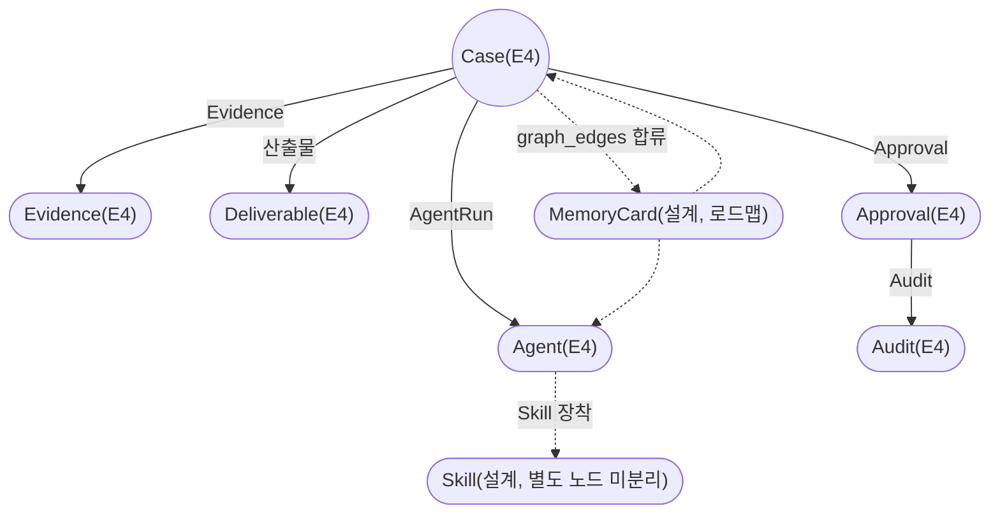

---
tags:
  - area/product
  - type/diagram
  - status/active
date: 2026-07-05
up: "[[INDEX|제품 인덱스]]"
---

# 운영계약 온톨로지 — 엔티티 그래프

> 이 그림의 주장 = 운영계약 7단(Case–AgentRun–Agent–Skill–Evidence–Approval–Audit)은 예선 앱에서 이미 케이스별 실데이터 관계 그래프로 렌더된다 — MemoryCard의 그래프 합류는 다음 단계다.

실선은 `initCaseOntology()`(`02_제품/app/modules.js`)가 cytoscape로 케이스 상세 화면에 실제 렌더하는 관계다(`ontologyElements()`). Skill은 현재 Agent 카드 안 속성일 뿐 독립 노드가 아니고, MemoryCard가 그래프에 합류하는 것은 3계층 메모리 설계의 로드맵 항목이다(점선).

## 연결
- [[08_본선/03_제품/docs/08_feature-spec|08_feature-spec]]
- [[11-메모리-3계층-자동진화-설계도]]
