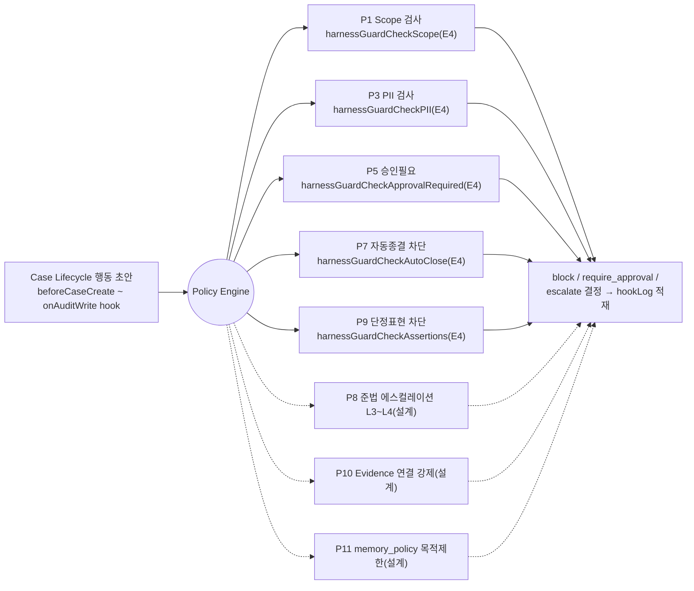

---
tags:
  - area/product
  - type/diagram
  - status/active
date: 2026-07-05
up: "[[INDEX|제품 인덱스]]"
---

# Policy Engine — 가드레일 게이트

> 이 그림의 주장 = Policy Engine은 신규 기능이 아니라 모든 상태 전이를 감싸는 강제 게이트다 — 5종 가드(scope·PII·승인필요·자동종결·단정표현)는 이미 코드에서 실행되고, 12규칙 중 7개가 이번 프로토타입에서 실제로 차단한다.

5종 가드(실선)는 4개 하네스(jeonse·wooricap·ccl·fdr) 공통 lifecycle hook에서 실제 실행되며 위반은 `harnessStore.hookLog`에 적재된다(`_vendor/JB_project2/app/harnessCore.js`). 준법 에스컬레이션·Evidence 강제·메모리 목적제한(점선) 등 확장 5규칙은 구조만 정의된 설계 단계다.

## 연결
- [[07-policy-engine]]
- [[03_approval-gate]]
