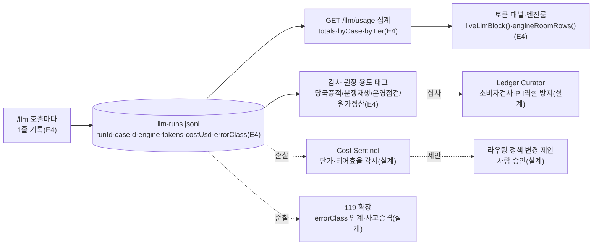

---
tags:
  - area/product
  - type/diagram
  - status/active
date: 2026-07-05
up: "[[INDEX|제품 인덱스]]"
---

# 관측가능성 데이터 흐름 — 원장에서 계기판까지

> 이 그림의 주장 = 원장 한 줄(llm-runs.jsonl)이 집계 API·토큰 계기판·감사 용도 태그까지 이어지는 단일 파이프라인이다 — 세 운영 에이전트는 이 파이프라인을 순찰하는 설계 확장일 뿐, 실행 권한은 없다.

원장→집계→계기판(토큰 패널·엔진룸)까지는 `?live=1` 데모에서 이미 실측 동작한다(E4). Cost Sentinel·119·Ledger Curator 세 에이전트는 이 파이프라인을 상시 순찰해 원가·오류·감사 실효성을 감시하는 설계 확장으로, 숫자와 제안만 만들고 정책 변경은 사람이 승인한다.

## 연결
- [[Q13-토큰비용-유닛이코노믹스]]
- [[Q15-감사로그-실효성]]
