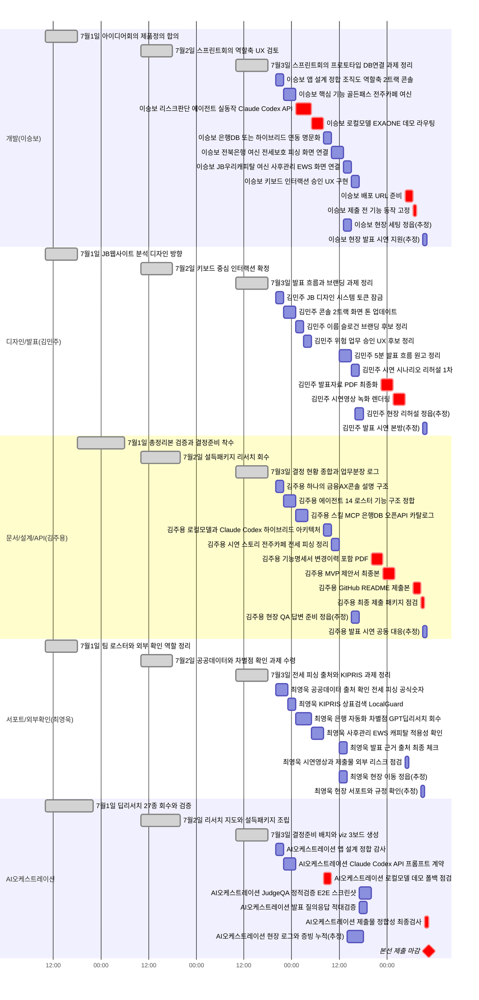

> 🗄️ **아카이브(2026-07-05)**: 히어로=전주카페 단일 프레임 전제가 이후 쇼케이스 6페르소나 피벗으로 낡음. 보관용으로 이동, 원 내용은 그대로 보존.

# 48h 스프린트 시간 간트 (7/3밤 ~ 7/5 10:30 제출)

> 팀원이 직접 체크하는 절차적 시간표이며 기존 날짜 단위 간트인 workflow-gantt-blueprint와 project-master-timeline을 시간 단위로 보완한다.
> 근거 문서는 PLAN·PROGRESS·결정-현황-종합·업무분장-작업로그·workflow-gantt-blueprint·project-master-timeline이다.

| 트랙 | 메인 담당 | 핵심 산출물 |
|---|---|---|
| 개발 | 이승보 | 실동작 콘솔·API·로컬모델 데모·배포 URL |
| 디자인/발표 | 김민주 | JB 디자인 시스템·브랜딩·발표자료·시연영상 |
| 문서/설계/API | 김주용 | 기능명세서·MVP 제안서·README·아키텍처 |
| 서포트/외부확인 | 최영욱 | 공공데이터·KIPRIS·출처·차별점 검증 |
| AI오케스트레이션 | Claude·Codex·로컬모델 | 설계 감사·QA·적대검증·제출 정합성 |